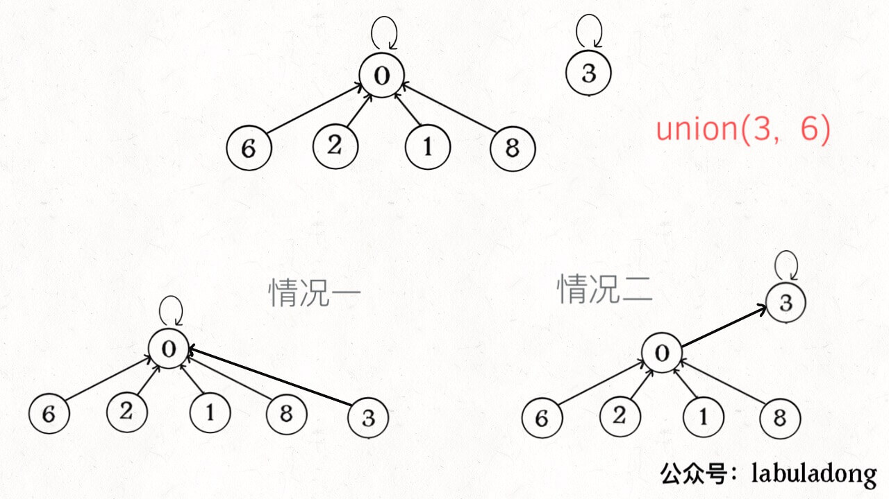

# 并查集

用来高效验证图的联通性：

### **核心思路**

* 保存一个int parent\[\]数组，count表示联通分量
* **如果某两个节点被连通，则让其中的（任意）一个节点的根节点接到另一个节点的根节点上**

```cpp
int parent[NUM_NODE];
int count; //连通分量

void union(int p, int q) {
    int rootP = find(p);
    int rootQ = find(q);
    if (rootP == rootQ)
        return;
    // 将两棵树合并为一棵
    parent[rootP] = rootQ; // parent[rootQ] = rootP 也一样
    count--; // 两个分量合二为一
}

int find(int x) {
    // 根节点的 parent[x] == x
    while (parent[x] != x)
        x = parent[x];
    return x;
}

int count(){
    return count; //返回连通分量
}
//判断是否连通
bool connected(int p, int q){
    int rootP = find(p);
    int rootQ = find(q);
    return rootP == rootQ;
}
```

### **平衡性优化**

**问题：** `find`主要功能就是从某个节点向上遍历到树根，其时间复杂度就是树的高度。我们可能习惯性地认为树的高度就是`logN`，但这并不一定。`logN`的高度只存在于平衡二叉树，对于一般的树可能出现极端不平衡的情况，使得「树」几乎退化成「链表」

 **上面这种解法，`find`,`union`,`connected`的时间复杂度都是 O\(N\)。这个复杂度很不理想的**

希望，小一些的树接到大一些的树下面，这样就能避免头重脚轻，更平衡一些

 解决方法是额外使用一个`size`数组，记录每棵树包含的节点数，我们不妨称为「重量」

 比如说`size[3] = 5`表示，以节点`3`为根的那棵树，总共有`5`个节点。这样我们可以修改一下`union`方法

```cpp
void union(int p, int q) {
    int rootP = find(p);
    int rootQ = find(q);
    if (rootP == rootQ)
        return;
    
    // 小树接到大树下面，较平衡
    if (size[rootP] > size[rootQ]) {
        parent[rootQ] = rootP;
        size[rootP] += size[rootQ];
    } else {
        parent[rootP] = rootQ;
        size[rootQ] += size[rootP];
    }
    count--;
}
```

通过比较树的重量，就可以保证树的生长相对平衡，树的高度大致在`logN`这个数量级，极大提升执行效率。

此时，`find`,`union`,`connected`的时间复杂度都下降为 O\(logN\)，即便数据规模上亿，所需时间也非常少。

### **路径压缩优化**

进一步压缩每棵树的高度，使树高始终保持为常数？ `find`就能以 O\(1\) 的时间找到某一节点的根节点，相应的，`connected`和`union`复杂度都下降为 O\(1\)。

 只需要在`find`中加一行代码：

```cpp
int find(int x) {
    while (parent[x] != x){
        //路径压缩
        parent[x] = parent[parent[x]];
        x = parent[x];
    }
    return x;
}

```

 调用`find`函数每次向树根遍历的同时，顺手将树高缩短了，最终所有树高都不会超过 3（`union`的时候树高可能达到 3）实际中，每次find都会进行路径压缩

#### 既然有路径压缩了，还有必要size数组重量平衡吗？

 论时间复杂度的话，确实，不需要重量平衡也是 O\(1\)。但是如果加上 `size` 数组辅助，效率还是略微高一些，比如下面这种情况：



 有重量平衡优化，一定会得到情况一，而不带重量优化，可能出现情况二。高度为 3 时才会触发路径压缩那个 `while` 循环，所以情况一根本不会触发路径压缩，而情况二会多执行很多次路径压缩，将第三层节点压缩到第二层。

**所以还是用空间换了一些时间**

### 完整版代码

 构造函数初始化数据结构需要 O\(N\) 的时间和空间复杂度；连通两个节点`union`、判断两个节点的连通性`connected`、计算连通分量`count`所需的时间复杂度均为 O\(1\)。

```cpp
class UF {
private:
    // 连通分量个数
    int count;
    // 存储一棵树
    vector<int> parent;
    // 记录树的“重量”
    vector<int> size;
public:
    UF(int n) {
        count = n;
        for (int i = 0; i < n; i++) {
            parent.push_back(i);
            size.push_back(1);
        }
    }
    
    void union(int p, int q) {
        int rootP = find(p);
        int rootQ = find(q);
        if (rootP == rootQ)
            return;
        
        // 小树接到大树下面，较平衡
        if (size[rootP] > size[rootQ]) {
            parent[rootQ] = rootP;
            size[rootP] += size[rootQ];
        } else {
            parent[rootP] = rootQ;
            size[rootQ] += size[rootP];
        }
        count--;
    }

    bool connected(int p, int q) {
        int rootP = find(p);
        int rootQ = find(q);
        return rootP == rootQ;
    }

    int find(int x) {
        while (parent[x] != x) {
            // 进行路径压缩
            parent[x] = parent[parent[x]];
            x = parent[x];
        }
        return x;
    }

    int count() {
        return count;
    }
}
```

