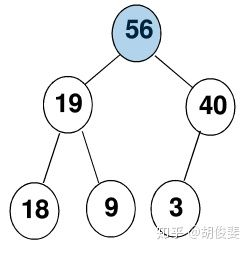
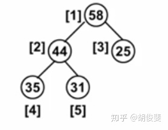
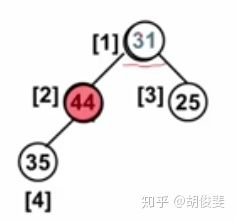
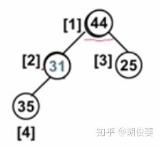
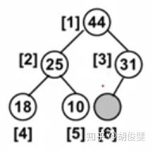

# 堆

## 最大堆/最小堆

优先队列实现的数据结构就是堆

**堆**通常是一个可以被看做一棵树的数组对象。**而这棵树一定是一棵完全二叉树，而且如果他是最小树，则每个节点必定大于它的父节点，如果是最大树则所有父节点一定大于它的儿子节点，所以它的树根一定最大或者最小**。比如形如这样的最大堆：、



### **堆的结构**

**堆通常是一个可以被看做一棵树的数组对象”**，所以它的结构就并不是左指针和右指针了，而是以数组的形式，而且为了方便后面的操作（像插入、删除...），堆的结构中还有Size代表它当前的长度和Capacity代表它的总容量：

```cpp
struct HeapStruct{
    ElementType *Element;
    int Size;
    int Capacity;
};
```

### **创建堆**

创建一个空间的指针，再附上结构中的各个初值

```cpp
MaxHeap CreatHeap(){
    MaxHeap H = malloc(sizeof(HeapStruct));
    H->Element=malloc((MaxSize+1)*sizeof(ElementType))
    H->Size=0;
    H->Capacity=Maxsize;
    H->Elenment[0]=MaxData;
    return H;
}
```

### **删除堆**

**删除：**这里的删除操作就有点意思了，如果你要从堆中删除一个数，因为堆就是为了完成**不同权值的主次删除**，所以堆从二叉树的角度来看，我就先以最大堆为示例（最小堆其实是一样的），既然叫做最大堆，肯定是从权值最大的删起，那就是从根节点删除一个节点（或者说弹出一个节点）。

首先这是一个最大堆，完全按最大堆的有序性排列。



这个时候我们要删除最大的元素，删除之后需要补上我们被删除的元素，可是因为这必须是一颗完全二叉树，所以我们不能贸然的随便移动节点，否则会引起不必要的麻烦，**所以我们将最后一个31先补在删除的位置，以保证完全二叉树的性质。**



然后我们会发现，我们的堆可能没有了之前的有序性，于是我们需要找到它儿子节点中比较大的那个，如果它比那个大的儿子小，就将它赋在儿子的位置上（需要保存它的值在一个开始变量中）。



然后继续做循环，直到所有儿子节点为空或者没有比它大的儿子。


### **插入堆**

删除这么有意思，插入一定也是吧！！！还是一个最大堆，删除为了不影响完全二叉树性质是在第一个位置，那么插入则是在最后一个位置：



假设值是58，由于比31（父节点）大。


然后在和父节点继续比较


得到最终结果，然后我们会发现一个问题，就是58会继续往上找，但是它并没有父节点怎么办呢？？我们的解决方法是设置一个**哨兵**，在所有堆的最上面（也就是数组的第0个元素），加一个一定比堆中所有值都大的数MAX就行啦~


