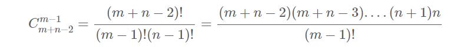

# 矩阵

**矩阵乘法**

```text
     |  1 0 0 |   | 7 0 0 |   |  7 0 0 |
AB = | -1 0 3 | x | 0 0 0 | = | -7 0 3 |
                  | 0 0 1 | 

int AB[rowA][colB];
memset(AB, 0, sizeof(AB));
for (int i = 0; i < rowA; i++)
    for (int j = 0; j < colB; j++)
        for (int k = 0; k < columnA; k++)
            AB[i][j] += A[i][k] * B[k][j];
return AB;
```

| 序号/难度 | 名字 | 备注 |  |
| :--- | :--- | :--- | :--- |
| 面试题01.07 | 旋转矩阵 | 90°旋转时 i,j坐标的位置关系 | 思路清晰 |
| lint 38 | 搜索二维矩阵-II | 从左下角往右上角搜索 O\(m+n\) | 技巧 |
|  |  | 能否：二分+分治搜索，一次淘汰掉1/4，并继续搜索三个子区域 | 代码会麻烦 |
| lint 114 | 不同的路径 | O\(n\)：排列组合 O\(N^2\)：dp，不太推荐 | 技巧 |


**面试题 01.07. 旋转矩阵**

**思路清晰：只用处理矩阵的半径即可，然后每次处理4个坐标的值依次轮转，用tmp存储一个值**

```cpp
给定 matrix = 
[
  [1,2,3],
  [4,5,6],
  [7,8,9]
],

原地旋转输入矩阵，使其变为:
[
  [7,4,1],
  [8,5,2],
  [9,6,3]
]

代码：
void rotate(vector<vector<int>>& matrix) {
    int N = matrix.size(); 
    int n = N / 2;
    for(int i = 0; i < n; i++){
        for(int j = i; j < N - i - 1; j++){
            int tmp = matrix[j][N-i-1];
            matrix[j][N-i-1] = matrix[i][j];
            matrix[i][j] = matrix[N-j-1][i];
            matrix[N-j-1][i] = matrix[N-i-1][N-j-1];
            matrix[N-i-1][N-j-1] = tmp;
        }
    }
}
```

**搜索二维矩阵-\|\|**

写出一个高效的算法来搜索m×n矩阵中的值，返回这个值出现的次数。

这个矩阵具有以下特性：

* 每行中的整数从左到右是排序的。
* 每一列的整数从上到下是排序的。
* 在每一行或每一列中没有重复的整数。

```text
输入: 
    [ 
      [1, 3, 5, 7], 
      [2, 4, 7, 8], 
      [3, 5, 9, 10] 
    ] 
    target = 3 
输出:2 
```

**解法：**

* 从左下角即\(n-1,0\)处出发
* 如果matrix\[x\]\[y\] &lt; target 下一步往右搜
* 如果matrix\[x\]\[y\] &gt; target 下一步往上搜
* 如果matrix\[x\]\[y\] = target 下一步往\[x-1\]\[y+1\]即右上角搜，因为是有序的，每一行每一列中每个数都是唯一的

**lint 114 不同的路径**

有一个机器人的位于一个 m × n 个网格左上角。

机器人每一时刻只能向下或者向右移动一步。机器人试图达到网格的右下角。

问有多少条不同的路径？（答案不超过32位）

**解决：**

```text
Input:  n = 3, m = 3
Output: 6        
Explanation:
        D : Down
        R : Right
        1) DDRR
        2) DRDR
        3) DRRD
        4) RRDD
        5) RDRD
        6) RDDR
```

本质等于，对\(n - 1\)个Down 与 \(m-1\)个Right进行排列组合



时间复杂度: O\(min\(m,n\)\)。计算阶乘的时间复杂度与m, n中的较小数成线性关系。

```python
def uniquePaths(self, m, n):
    # corner case
    if (m == 1 or n == 1):
        return 1

    # 保证m <= n
    if (m > n):
        m, n = n, m

    # 计算阶乘
    temp = 1
    res = 1
    for i in range(1, m):
        temp *= i
    for i in range(n, m + n - 1):
        res *= i
    return res//temp
```

