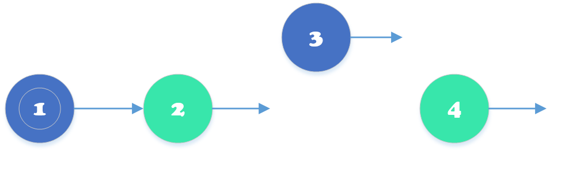
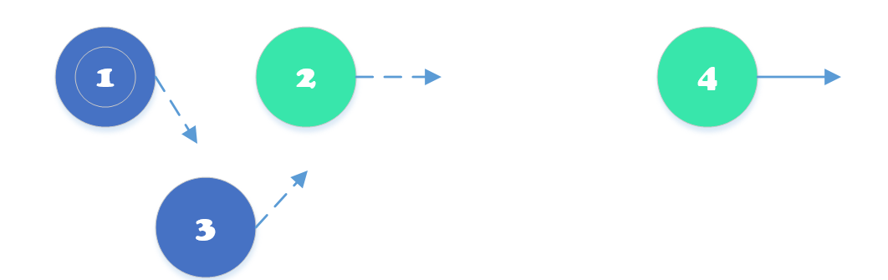
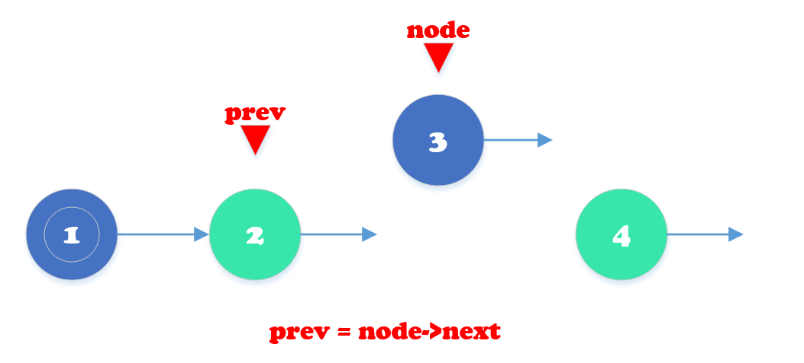
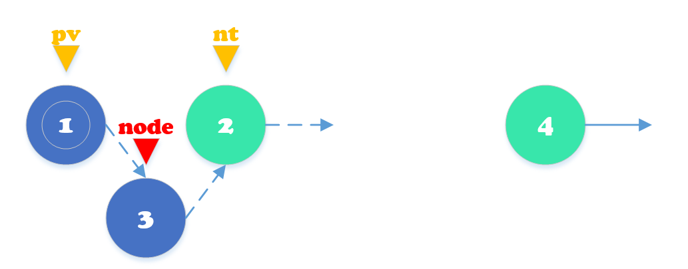
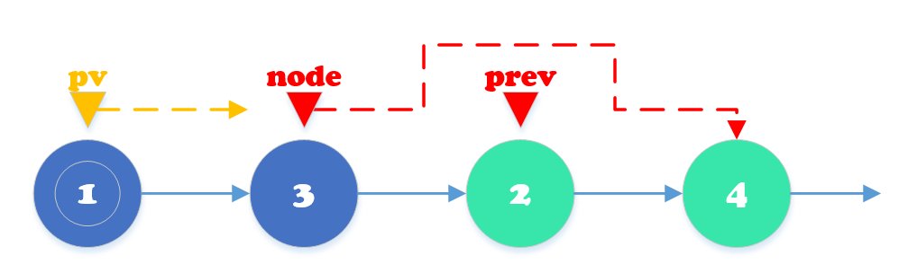

# 节点移动问题

#### 节点移动问题（解决时画图分析）

### **五步法：**

* 特判，需不需要dummyhead
* ①定位问题：是节点移动问题
* ②确定行为：抽离 + 插入
* ③确定指针（代码中需要声明的指针，自变or他变）+ 执行操作
* ④确定自变指针的递归策略
* ⑤初始设定 + 终止条件（step4,step5可以互换位置）

**以328.奇偶链表问题为例**

题意：给定一个单链表，把奇数位置的节点放在前面，然后把偶数节点的放在后面

\(注意：这里的奇数节点和偶数节点指的是节点编号的奇偶性，而不是节点的值的奇偶性\)

### **step1: 定位问题：是节点移动问题**

因为是**将链表中的一个节点移动到另一个位置**


### **step2: 确定行为：节点移动问题包含 两个行为**

**两个行为**

* **抽离**：**抽出的是node**，本题我们要将**奇数节点③**抽离出来



* **插入**：**插入的是位置location，包含两个节点一前一后**，本题要将抽离出来的节点插入到**①与②之间**




### **step3: 根据行为来确定指针（代码中需要声明的指针）+ 完成操作**

到底用到了哪些指针，**自变指针**是什么，**他变指针**是什么

**1.** **抽离行为**



* **所含指针**：
  * **prev指针**
  * **node指针**
* **更新操作**：
  * prev = node-&gt;next

**2.插入**



* **所含指针**：
  * **pv指针**（前面奇数尾端的指针）
  * **nt指针**（前面奇数尾端指针pv的下一个指针）
* **更新操作**：
  * pv-&gt;next = node
  * node-&gt;next = nt

我们发现我们**总共需要定义四个指针**

**自变指针** 是指 **每次循环的时候，需要更新自己**（例如node节点），或者是再循环结束前更新（例如prev节点）

* **自变指针**往往需要**在遍历之前定义**

**他变指针** 往往是**临时性指针**，往往都是每一次操作前由自变指针计算得到的，用来临时存储

（例如nt = pv-&gt;next之后才能去更新pv-&gt;next\)

* **他变指针往往不需要更新**
* **每次遍历都可以定义一次**

所以

**自变指针**就是 pv, prev, node

**他变指针** 就是nt

```cpp
ListNode* pv. prev, node; //提前定义自变指针
```

**处理操作代码（3行）**：简单写的话并不需要nt指针

```cpp
/*操作:简单写的话并不需要nt指针*/
node  //取出
prev->next = node->next; //缝合
node->next = pv->next; //接尾部
pv->next = node; //接头部
```

### **step4: 自变指针的递归策略**

根据题意：

* 如果是要**把奇数节点放在前面**，例如（1，3，5，2，4）那么，头节点必然还是头节点**就不需要创建dummyhead**
* 如果是把偶数节点放在前面，例如（2，4，1，3，5）那么，就需要创建一个dummyhead，相当于0，然后就跟前一种情况是一样的

所以我们这里两种情况就都可以当成一种情况处理了

这个奇偶链表问题，我们要分两种情况讨论：

* ①如果需要移动节点，cnt为奇数
  * pv: 在插入节点后更新：pv = pv-&gt;next
  * prev：不变
  * node：在循环结束时：node = prev-&gt;next**（node是主导节点，主导遍历的节点）**



* ②如果不需要移动节点，cnt为偶数
  * pv:不变
  * prev: 在循环结束时：prev = node；\(再循环结束时一般都是先更新prev再更新node\)
  * node: 在循环结束时：node = node-&gt;next

实现的时候，记录**cnt为循环序号**，第一次循环cnt=0，以此类推，根据cnt奇数偶数来决定哪种情况

### **step5: 初始设定+终止条件\(视具体情况而定\)**

### **最终代码**

```cpp
ListNode* oddEvenList(ListNode* head) {
    if(!head)return NULL; //特判
    ListNode* pv, *prev, *node;//3.声明指针
​
    pv = head; //5.初始化
    prev = head;
    if(!head->next)return head; //特判
    node = head->next;
    int cnt = 0;
​
    while(node!=NULL){ //5.终止条件
        if(cnt % 2){
            /*3.operate*/
            prev->next = node->next; //缝合
            node->next = pv->next;   //接尾部
            pv->next = node;         //头部
            
            ​/*4.iterate*/
            node = prev->next;
            pv = pv->next;
        }else{
            prev = node;
            node = node->next;
        }
        cnt++;
    }
    return head;
}
```

