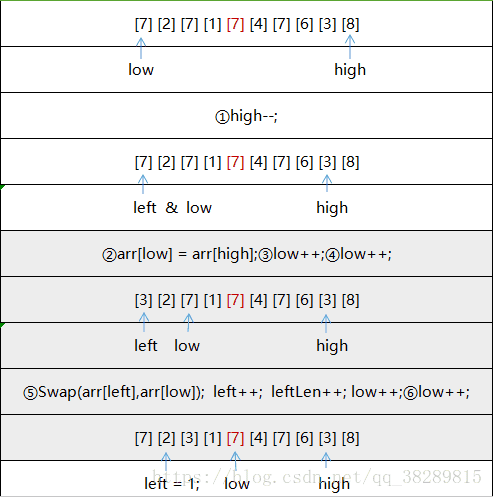
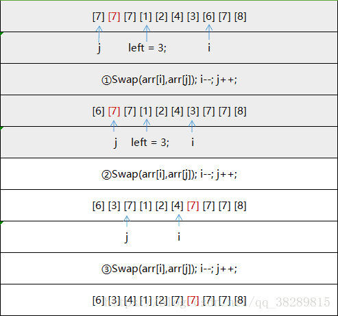

# 快速排序变体：聚集元素, Kth

**Three-way Partition （聚集元素）**

在快速排序中，有一个**变种**是**将选择的pivot都放到中间**。 

例如 \[5,1,5,7,5,8,3,5\]，选择最末尾的 5 作为pivot，partition以后可以变成 \[3,1,5,5,5,5,8,7\]。

之后再partition时，把比5小的放在左边，把比5大的放在右边

也就是处理\[3,1\]与\[8,7\]，**对于重复元素比较多的聚集情况，这是一种很有效的优化**

**步骤**

* **选基准**：可以按照median-of-3选出一个
* ①在划分过程中将与基准值相等的元素放入数组两端
* ②划分结束后，再将两端的元素移到基准值周围。

**第①步：**




**第②步：**



### **快排变体：聚集元素模板**

```cpp
//目标：将pivot的数聚集起来
//nums[left, p) < nums[pivot]
//nums[p, q) = nums[pivot]
//nums[q, right] > nums[pivot]
void quickSort(vector<int>& nums, int left, int right){
    //threeWayPartition
    int pivot = nums[right], p = left, q = p;
    for(int i = left; i < right; i++){
        if(nums[i] <= nums[pivot]){//仔细看一些发现，类似于threeColor的思路，维护p,q
            swap(nums[q++], nums[i]);//如果小于等于，先换到q的右边
            if(nums[q-1] < nums[pivot])swap(nums[p++],nums[q-1]);//如果是小于，再换到p的右边
    }
    swap(nums[q++], nums[right]); //处理最右边的pivot
    quickSort(nums, left, p-1);
    quickSort(nums, q, right);
}

```

### 快速变体：kth模板

注意是**TopK**，还是**Kth \(Kth都可以，当然也可以找中位数）**

```cpp
//基本partition模板
int partition(vector<int>&nums, int i, int j){
    int pivot_val = nums[i];
    while(i != j){
        while(i < j && pivot_val <= nums[j])j--; //即使i提前等于j了，交换两者也没有任何关系
        swap(nums[i], nums[j]);            //std::swap
        while(i < j && pivot_val >= nums[i])i++; //val = nums[i]相等这种情况就不需要交换了
        swap(nums[i], nums[j]);
    }
    return i;
}
//提前要进行k的合法性判断
//TopK: 1 <= k <= nums.size()       0, .. k-1
//Kth:  0 <= k <= nums.size() - 1   1，2，3，...，kth
int Kth(vector<int>&nums, int k){
    //所有k都转换成k-1
    int left = 0, right = nums.size() -1;
    do {
        int pivot = partition(nums, left, right);
        if(pivot == k-1)break;
        else if(pivot > k-1)right = pivot - 1;
        else left = pivot + 1;
    }while(true);        
    return nums[k-1];
}
vector<int> TopK(vector<int>&nums, int k){
    int left = 0, right = nums.size() -1;
    do {
        int pivot = partition(nums, left, right);
        if(pivot == k-1)break;
        else if(pivot > k-1)right = pivot - 1;
        else left = pivot + 1;
    }while(true);       
    //TopK: 
    vector<int> result(nums.begin(), nums.begin() + k);
    return result;
}
```

### 聚集元素 + kth结合版

```cpp
void threeWayPartition_Kth(vector<int>&nums, int k){
    //确认K在[0,len)范围之内
    int len = nums.size();
    int left = 0, right = len - 1;
    while(true){
        //目标：将pivot的数聚集起来，并找到第k小的pivot
        //nums[left, p) < nums[pivot]
        //nums[p, q) = nums[pivot]
        //nums[q, right] > nums[pivot]
        //threeWayPartition
        int pivot_val = nums[right], p = left, q = p;
        for(int i = left; i < right; i++){
            if(nums[i] <= pivot_val){//仔细看一些发现，类似于threeColor的思路，维护p,q
                swap(nums[q++], nums[i]);//如果小于等于，先换到q的右边
                if(nums[q-1] < pivot_val)swap(nums[p++],nums[q-1]);//如果是小于，再换到p的右边
            }
        }
        swap(nums[q++], nums[right]);
        //find Kth
        if (k < p)//k在[left,p)
            right = p - 1;
        else if (k < q)//k在[p,q)
            return;
        else {//k在[q,right]
            left = q;
        }
    }
}
```

### **题目**

<table>
  <thead>
    <tr>
      <th style="text-align:left">&#x5E8F;&#x53F7;/&#x96BE;&#x5EA6;</th>
      <th style="text-align:left">&#x540D;&#x5B57;</th>
      <th style="text-align:left">&#x5907;&#x6CE8;</th>
      <th style="text-align:left"></th>
    </tr>
  </thead>
  <tbody>
    <tr>
      <td style="text-align:left">75</td>
      <td style="text-align:left">&#x989C;&#x8272;&#x5206;&#x7C7B;&#xFF08;&#x8377;&#x5170;&#x56FD;&#x65D7;&#xFF09;</td>
      <td
      style="text-align:left">&#x5FEB;&#x6392;&#x53D8;&#x4F53;&#xFF1A;<b>&#x805A;&#x96C6;&#x5143;&#x7D20;</b>
        </td>
        <td style="text-align:left">&#x6A21;&#x677F;</td>
    </tr>
    <tr>
      <td style="text-align:left">&#x5251;&#x6307;Offer 40 / 215</td>
      <td style="text-align:left">&#x6700;&#x5C0F;&#x7684;k&#x4E2A;&#x6570;&#xFF08;TopK, kth&#xFF09;</td>
      <td
      style="text-align:left">&#x5FEB;&#x6392;&#x53D8;&#x4F53;&#xFF1A;<b>kth</b>
        </td>
        <td style="text-align:left">&#x6A21;&#x677F;</td>
    </tr>
    <tr>
      <td style="text-align:left">324</td>
      <td style="text-align:left">&#x6446;&#x52A8;&#x6392;&#x5E8F;-II</td>
      <td style="text-align:left">
        <p>&#x5FEB;&#x6392;&#x53D8;&#x4F53;&#xFF1A;<b>&#x805A;&#x96C6;&#x5143;&#x7D20;</b> + <b>kth(&#x8FD9;&#x91CC;kth&#x5C31;&#x662F;&#x4E2D;&#x4F4D;&#x6570;)</b> + <b>&#x865A;&#x62DF;&#x6620;&#x5C04;</b>
        </p>
        <p><b>&#xFF08;&#x524D;&#x8005;&#x4FDD;&#x8BC1;O(N)&#x7684;&#x65F6;&#x95F4; + &#x540E;&#x8005;&#x4FDD;&#x8BC1;O(1)&#x7684;&#x7A7A;&#x95F4;&#xFF09;</b>
        </p>
      </td>
      <td style="text-align:left">&#x89E3;&#x9898;&#x6280;&#x5DE7;</td>
    </tr>
    <tr>
      <td style="text-align:left"></td>
      <td style="text-align:left"></td>
      <td style="text-align:left"></td>
      <td style="text-align:left"></td>
    </tr>
    <tr>
      <td style="text-align:left"></td>
      <td style="text-align:left"></td>
      <td style="text-align:left"></td>
      <td style="text-align:left"></td>
    </tr>
  </tbody>
</table>

**75. 颜色分类**

**对一个只有0,1,2三种值的数组进行排序，要求只扫一遍**

**解法：按照聚集元素模板来做,**

* **甚至不用递归更新left,right，只维护p，q**
* **最右边也不是pivot，pivot数值确定了=1**
  * nums\[left, p\) &lt; nums\[pivot\]
  * nums\[p, q\) = nums\[pivot\]
  * nums\[q, right\] &gt; nums\[pivot\]

```cpp
void sortColors(vector<int>& nums) {
   int len = nums.size();
   if(len == 0)return;
   int p = 0, q = p;
   int pivot_val = 1;
   for(int i = 0; i < len; i++){
      if(nums[i] <= pivot_val){
           swap(nums[q++], nums[i]);//如果小于等于，先换到q的右边
           if(nums[q-1] < pivot_val)swap(nums[p++],nums[q-1]);//如果是小于，再换到p的右边
      }
   }
}
```

**剑指Offer 40  TopK / 215.Kth**

**快速排序变体 O\(N\)**

经过**快速排序算法中的一次普通划分后**，基点左边的所有数小于基点，右边的所有数大于基点，基点位置pivot有三种情况：

* pivot = k 说明基点就是第k+1个小的元素，其左边的子数组就是最小的k个数。此时的子数组\[0, k\) 就是答案 
* pivot &gt; k 说明基点"偏大"了，对其左子数组继续进行划分 
* pivot &lt; k 说明基点"偏小"了，对其右子数组继续进行划分

**另外做法：最大堆，最小堆（堆排序）O\(NlogK）**

\*\*\*\*

**324. 摆动排序 II**

 给定一个无序的数组 `nums`，将它重新排列成 `nums[0] < nums[1] > nums[2] < nums[3]...` 的顺序。

**题解：**

**①聚集元素 + kth结合版**

经过**快速排序算法中的一次划分后**，基点左边的所有数小于基点，右边的所有数大于基

 例如 \[5,1,5,7,5,8,3,5\]，选择末尾作为pivot，partition以后可以变成 \[3,1,5,5,5,5,8,7\]。 **用此方法可以将nums数组中的pivot都相邻在一起**。

**pivot不一定是中位数**

* pivot == mid 说明基点就是中位数，直接ok
* **pivot &lt; mid 那么把pivot左边数组部分，重新按照上述再进行一次快速排序划分**
* **pivot &gt; mid也是类似**

**直到pivot是中位数**

所以最终我们可以将数组**按中位数partition**，然后左边的数放0,2,4的位置，右边的放1,3,5的位置，**这里可以用非递归的实现达到 空间复杂度O\(1\)**。 （递归实现的平均空间复杂度为O\(logn\)\)

**当中位数的个数超过半数时，不存在可行解**

\*\*\*\*

**②虚拟映射：inplace插空，O\(1\)空间**

**将数组的两段插空，一般需要额外的空间，但通过巧妙的下标映射可以实现自动插空**

对于所有数组元素的访问，我们可以实现一个虚拟的映射

例如，当长度为 8时， \[a, b, c, d, e, f, g, h\] -&gt; \[a, e, b, f, c, g, d, h\]。 当长度为 9时， \[a, b, c, d, e, f, g, h, i\] -&gt; \[a, f, b, g, c, h, d, i, e\]。 具体的下标映射公式是： 

```cpp
i <= (n - 1) / 2 ? i * 2 : (i - (n + 1) / 2) * 2 + 1
```

i 其中 n 为数组长度， i 为虚拟下标。 

例如，当数组长度为 9 切访问的虚拟下标为 2 时，实际访问的下标为 5

**代码：**

```cpp
//virtual mapping to new index
//e.g. n = 8, [a, b, c, d, e, f, g, h] -> [a, e, b, f, c, g, d, h]
//e.g. n = 9, [a, b, c, d, e, f, g, h, i] -> [a, f, b, g, c, h, d, i, e]
int vmap(int n, int i) { //所有nums[i]都要替换成nums[vmap(len,i)]
    return i <= (n - 1) / 2 ? i * 2 : (i - (n + 1) / 2) * 2 + 1;
}

void threeWayPartition_Kth(vector<int>&nums, int k){
    //确认K在[0,len)范围之内
    int len = nums.size();
    int left = 0, right = len - 1;
    while(true){
        //目标：将pivot的数聚集起来，并找到第k小的pivot
        //nums[left, p) < nums[pivot]
        //nums[p, q) = nums[pivot]
        //nums[q, right] > nums[pivot]
        //threeWayPartition
        int pivot_val = nums[vmap(len,right)], p = left, q = p;
        for(int i = left; i < right; i++){
            if(nums[vmap(len,i)] <= pivot_val){//仔细看一些发现，类似于threeColor的思路，维护p,q
                swap(nums[vmap(len,q++)], nums[vmap(len,i)]);//如果小于等于，先换到q的右边
                if(nums[vmap(len,q-1)] < pivot_val)swap(nums[vmap(len,p++)],nums[vmap(len,q-1)]);//如果是小于，再换到p的右边
            }
        }
        swap(nums[vmap(len,q++)], nums[vmap(len,right)]);
        //find Kth
        if (k < p)//k在[left,p)
            right = p - 1;
        else if (k < q)//k在[p,q)
            return;
        else {//k在[q,right]
            left = q;
        }
    }
}
void wiggleSort(vector<int>& nums) {
    if(nums.size() <=  1)return;
    int len = nums.size(), mid = (len - 1) / 2;
    threeWayPartition_Kth(nums, mid);
    //reverse index [0, 2, 4, 6, ...]
    for (int p = 0, q = mid; p < q; p++, q--)
        swap(nums[vmap(len,p)], nums[vmap(len,q)]);
    //reverse index [1, 3, 5, 7, ...]
    for (int p = mid + 1, q = len - 1; p < q; p++, q--)
        swap(nums[vmap(len,p)], nums[vmap(len,q)]);
}
```

