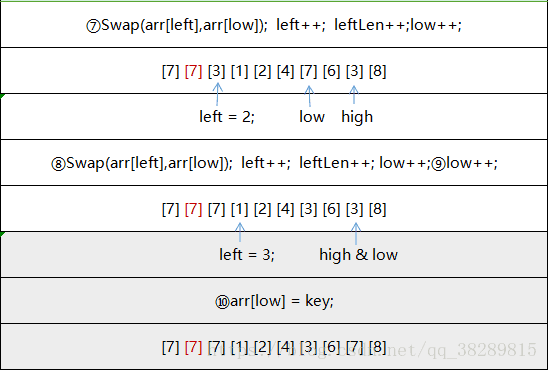

# 快速排序3-way-partition变体

### Three-way Partition 

在快速排序中，有一个**变种**是**将选择的pivot都放到中间**。 

例如 \[5,1,5,7,5,8,3,5\]，选择最末尾的 5 作为pivot，partition以后可以变成 \[3,1,5,5,5,5,8,7\]。

之后再partition时，把比5小的放在左边，把比5大的放在右边

也就是处理\[3,1\]与\[8,7\]，**对于重复元素比较多的聚集情况，这是一种很有效的优化**

**步骤**

* **选基准**：可以按照median-of-3选出一个
* ①在划分过程中将与基准值相等的元素放入数组两端
* ②划分结束后，再将两端的元素移到基准值周围。

**第①步：**

**第②步：**

### **题目**

| 序号/难度 | 名字 | 备注 |  |
| :--- | :--- | :--- | :--- |
| 75 | 颜色分类（荷兰国旗） | 对只存在0,1,2值的数组排序，双指针 | 理清关系 |
| 324 | 摆动排序 | 要求O\(n\)时间，O\(1\)空间 | 解题技巧 |

