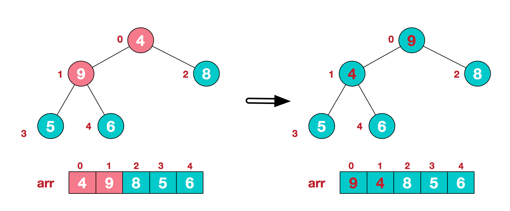

# 六大排序算法模板

### 快速排序 \(普通版 + 优化版）

思想：就是

**基本模板：4个关键点（注释上）**

```cpp
int partition(vector<int>&nums, int i, int j){
    int val = nums[i];
    while(i != j){
        while(i < j && val <= nums[j])j--; //即使i提前等于j了，交换两者也没有任何关系
        swap(nums[i], nums[j]);            //std::swap
        while(i < j && val >= nums[i])i++; //val = nums[i]相等这种情况就不需要交换了
        swap(nums[i], nums[j]);
    }
    return i;
}
void sort(vector<int>&nums, int left, int right){
    if(left >= right)return;
    int i = partition(nums, left, right);
    sort(nums, left, i-1);  //注意nums[i]就不用再放进去排了
    sort(nums, i+1, right);
}
vector<int> sortArray(vector<int>& nums) {
    sort(nums, 0, nums.size()-1);
    return nums; 
}
```

**非递归（只用改sort，用栈存传入参数left,right就好了）**

```cpp
void sort(vector<int>&nums, int left, int right){
    if(left >= right)return;
    stack<int>temp;
    temp.push(right);//先存右指针
    temp.push(left);//再存左指针
    while (!temp.empty()){
        left = temp.top();//先弹出左指针
        temp.pop();
        right = temp.top();//再弹出右指针
        temp.pop();
        if (left < right){
            int k = partition(nums, left, right);
            if (k > left){
                temp.push(k - 1);
                temp.push(left);
            }
            if (right > k){
                temp.push(right);
                temp.push(k + 1);
            }
        }
    }
}
```

**更优的快速排序实现：**

* **①Median-of-3** 
* **②当 元素个数 &lt; threshold 使用insertion sort**
* **③尾递归优化**

**（关键在于median-of-3的实现）**

```cpp
int partition(vector<int>&nums, int i, int j){
    /*难点：median-of-three*/
    int mid = (i + j) /2;
    if(nums[i] > nums[mid])swap(nums[mid], nums[i]);
    if(nums[i] > nums[j])swap(nums[i], nums[j]);
    if(nums[mid] > nums[j])swap(nums[mid], nums[j]); //不符合left <= mid <= right的话交换
    swap(nums[i], nums[mid]); //把基准换到左边
    int val = nums[i];

    while(i != j){
        while(i < j && val <= nums[j])j--;
        swap(nums[i], nums[j]);
        while(i < j && val >= nums[i])i++; 
        swap(nums[i], nums[j]);
    }
    return i;
}
int insertionSort(vector<int>&nums, int i, int j);

void sort(vector<int>&nums, int left, int right){
    if(left >= right)return; // 如果insertionSort有判边界，就可以省去这一句
    if(left + 10 >= right){ //长度如果小于等于10，就直接插入排序
        insertionSort(nums, left, right);
        return;
    }
    while(left < right){  //尾递归优化
        int pivot = partition(nums, left, right);
        sort(nums, left, pivot-1);
        left = pivot + 1;
    }
}
vector<int> sortArray(vector<int>& nums) {
    sort(nums, 0, nums.size()-1);
    return nums; 
}
```

### 归并排序 \(普通版 + inplace版）

**普通版**

```cpp
void mergeSort(vector<int>& nums, int left, int right){
    if(left >= right)return;
    vector<int>temp; //尽量用int[] 
    temp.reserve(right-left+1);
    int mid = (left + right) / 2;
    mergeSort(nums, left, mid);
    mergeSort(nums, mid+1, right);
    int i = left, j = mid + 1;
    while(i <= mid && j <= right){
        if(nums[i] < nums[j])temp.push_back(nums[i++]);
        else temp.push_back(nums[j++]);
    }
    while(i <= mid)temp.push_back(nums[i++]);
    while(j <= right)temp.push_back(nums[j++]);
    for(int i = left; i <= right; i++){
        nums[i] = temp[i-left];
    }
}
vector<int> sortArray(vector<int>& nums) {
    mergeSort(nums, 0, nums.size()-1);
    return nums;
}
```

#### inplace版**（时间开销很大）**：

#### 在归并排序上改进，以时间复杂度换空间复杂度，利用元素反转完成排序

 在原地归并排序中最主要用到了**内存反转**，即交换相邻的两块内存

**内存反转**是给定序列a1,a2,...,an,b1,b2,...,bn,反转成 b1,b2,...,bn,a1,a2,...,an

**merge的原理**


（**核心：主要是reverse要反转三次**）

```cpp
void reverse(vector<int>&nums, int left, int right){
    int i = left, j = right;
    while(i < j){
        swap(nums[i++], nums[j--]);
    }
}
void convert(vector<int>&nums, int left, int mid, int right){//内存反转
    reverse(nums, left, mid);
    reverse(nums, mid+1, right);
    reverse(nums, left, right);
}
void merge(vector<int>& nums, int left, int mid, int right){
    int i = left, j = mid + 1;
    while (i < j && j <= right){
       while (i < j && nums[i] <= nums[j])i++;
       int index = j;
       while (j <= right && nums[j] < nums[i])j++;
       convert(nums, i, index - 1, j - 1);
       i += j - index;
    }
}
void mergeSort(vector<int>& nums, int left, int right){
    if(left >= right)return;
    int mid = (left + right) / 2;
    mergeSort(nums, left, mid);
    mergeSort(nums, mid+1, right);
    merge(nums, left, mid, right);
}
vector<int> sortArray(vector<int>& nums) {
    mergeSort(nums, 0, nums.size()-1);
    return nums;
}
```

### 堆排序

 一种**选择排序，**每趟从待排序的记录中选出关键字最小的记录，顺序放在已排序的记录序列末尾，直到全部排序结束为止。

① **构造初始堆。将给定无序序列构造成一个大顶堆（一般升序采用大顶堆）**

**这一点有点点反直觉，也就是升序小数在前应该是对应最大堆**

* 初始给定无序序列结构如下


* 我们从最后一个非叶子结点开始（叶结点自然不用调整，第一个非叶子结点 arr.length/2-1=5/2-1=1，也就是下面的6结点），从左至右，从下至上进行调整。





* 最终形成一个大顶堆

2. **将堆顶元素与末尾元素进行交换，使末尾元素最大。（相当于把最大元素从堆中移除，放在最尾端，所以就已经排好了序）然后继续调整堆，再将堆顶元素与末尾元素交换，得到第二大元素。如此反复进行交换、重建、交换。**


```cpp
void maxHeap(vector<int>& nums, int parent, int len){ 
/*从上往下，与两个child比较，如果比child小，就要交换位置，因为是大顶堆*/
    int child = 2 * parent + 1; 
    while(child < len){
        if(child + 1 < len && nums[child] < nums[child + 1])child++; //
        if(nums[child] > nums[parent]){
            swap(nums[child], nums[parent]);
            parent = child;
            child = 2 * parent + 1;
        }else break;
    }
}
void heapSort(vector<int>& nums){
    int len = nums.size();
    for(int i = (len - 1) / 2; i >= 0; i--){ //调整非叶子节点
        maxHeap(nums, i, len);
    }/*构成大顶堆*/
    
    for(int j = len; j > 0; j--){
        maxHeap(nums, 0, j); //每次相当于移除一个最大元素到堆尾
        swap(nums[0], nums[j-1]);
    }
}
vector<int> sortArray(vector<int>& nums) {
    heapSort(nums);
    return nums;
}
```

### 桶排序

**实现：数组存每个桶的链表指针**

假设一组数据\(20长度\)为

```text
[63,157,189,51,101,47,141,121,157,156,194,117,98,139,67,133,181,13,28,109] 
```

现在需要按5个分桶，进行桶排序，步骤如下：

* ①分桶： 找到数组中的最大值194和最小值13，然后根据桶数为5，计算出每个桶中的数据范围为`(194-13+1)/5=36.4`
* ②遍历原始数据，根据每个数所属的数值范围，放入对应的桶
* ③入桶：桶本身是存储链表的，所以自然而然每个元素入桶都选用插入排序的方式
  * 判断桶中已存在的数字与新插入的数字的大小，按从左到右，从小打大的顺序插入。如第一个桶已经有了63，再插入51，67后，桶中的排序为\(51,63,67\)
* ④合并桶：全部数据装桶完毕后，按序列，从小到大合并所有非空的桶\(如0,1,2,3,4桶\)


#### 时间复杂度：

* N次循环，每一个数据装入桶
* 然后M次循环，每一个桶中的数据进行排序\(每一个桶中有N/M个数据\)，假设为使用比较先进的排序算法进行排序（ **理论上来说\(N个数都符合均匀分布\)，当M=N时，有一个最小值为O\(N\)）**

```text
O(N)+O(M*(N/M)*log(N/M))=O(N*(log(N/M)+1))
```

**空间复杂度：**

需要创建M个桶的额外空间，以及N个元素的额外空间   **O\(N+M\)**

#### 稳定性 <a id="section-4-3"></a>

比如a在b前面，a=b，排序后，a仍然应该在b前面，这样就算稳定的。

桶排序中，假如升序排列，a已经在桶中，b插进来是永远都会a右边的\(因为一般是从右到左，如果不小于当前元素，则插入改元素的右侧\)

**所以桶排序是稳定的**

\*\*\*\*

### 基数排序

**按照数位：从低位开始向高位排序**

示例：比如这样一个数列排序: 342 58 576 356, 以下描述演示了具体的排序过程

```cpp
第一次排序(个位):
3 4    2
5 7    6
3 5    6
0 5    8
第二次排序(十位):
3  4   2
3  5   6
0  5   8
5  7   6
第三次排序(百位):
0   5 8
3   4 2
3   5 6
5   7 6
结果: 58 342 356 576
```

**正整数的radixSort实现：**

```cpp
/********************************************************
 *函数名称：getLoopTimes
 *参数说明：num 一个整形数据
 *说明：   返回num的位数
 *********************************************************/
int getLoopTimes(unsigned int num) {
    int count = 1;
    unsigned int temp = num / 10;
    while (temp != 0) {
        count ++;
        temp = temp / 10;
    }
    return count;
}
/********************************************************
 *函数名称：getMaxNum
 *参数说明：array 代排序的数
 *        length 数组长度
 *说明：   返回最大值
 *********************************************************/
unsigned int getMaxNum(unsigned int array[], int length) {
    unsigned int max = 0;
    for (int i = 0; i < length; i++) {
        if (max < array[i]) {
            max = array[i];
        }
    }
    return max;
}

/********************************************************
 *函数名称：getNumInPos
 *参数说明：num 一个整形数据
 *          pos 表示要获得的整形的第pos位数据
 *说明：    找到num的从低到高的第pos位的数据
 *********************************************************/
int getNumInPos(int num, int pos) {
    // 求桶的 index 的除数，如：798
    // 个位桶 index = (798 / 1) % 10 = 8
    // 十位桶 index = (798 / 10) % 10 = 9
    // 百位桶 index = (798 / 100) % 10 = 7
    int temp = 1;
    for (int i = 0; i < pos - 1; i++) {
        temp *= 10;
    }
    return (num / temp) % 10;
}

/********************************************************
 *函数名称：radixSort
 *参数说明：array 无序数组
 *        length 数组长度
 *说明：   基数排序
 *********************************************************/
void radixSort(unsigned int array[], int length) {
    // 分别为 0~9 的序列空间
    unsigned int *radixArrays[RADIX_10];
    for (int i = 0; i < RADIX_10; i ++) {
        radixArrays[i] = (unsigned int *)malloc(sizeof(unsigned int) * (length + 1));
        radixArrays[i][0] = 0; // 下标为0处元素记录这组数据的个数
    }
    // 获取数组中的最大数
    unsigned int maxNum = getMaxNum(array, length);
    // 获取最大数的位数，也是再分配的次数
    int loopTimes = getLoopTimes(maxNum);
    // 对每一位进行分配
    for (int pos = 1; pos <= loopTimes; pos ++) {
        // 分配过程
        for (int i = 0; i < length; i ++) {
            int num = getNumInPos(array[i], pos);
            int index = ++ radixArrays[num][0];
            radixArrays[num][index] = array[i];
        }
        // 收集过程
        for (int i = 0, j = 0; i < RADIX_10; i ++) {
            for (int k = 1; k <= radixArrays[i][0]; k ++) {
                array[j++] = radixArrays[i][k];
            }
            radixArrays[i][0] = 0; // 复位
        }
        // 输出数组内容
        //print(array, length);
    }
}
```

### 插入排序

认定元素i左边已经是从小到大排好序的部分  
从**nums\[i\]**往左边找\(j--\)，找到刚好比nums\[j\]大的插入到nums\[j+1\]的位置

```cpp
 vector<int> insertionSort()(vector<int>& nums) {
    for
}
```

### 冒泡排序

```cpp
vector<int> bubbleSort(vector<int>& nums){
    for(int i = 0; i < nums.size() - 1; i++){ //注意边界[0,n-1)
        for(int j = 0; j < nums.size() - 1 - i; j++){ //注意边界[0,n-1-i)
             if(nums[j] > nums[j+1])swap(nums[j], nums[j+1]);
        }
    }
    return nums;
}
```

