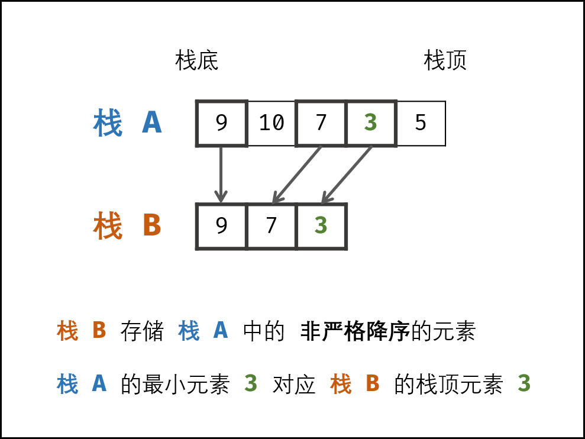

# 栈与队列

利用deque实现一个栈，先进先出

```cpp
deque<int>s;

ListNode* node = head;
while(node!=NULL){
    s.push_front(node->val); //添加
    node = node->next;
}

vector<int> res;
while(!s.empty()){
    res.push_back(s.front()); //访问
    s.pop_front();            //移出
}
```

**题目**

| 序号/难度 | 名字 | 备注 |  |
| :--- | :--- | :--- | :--- |
| 剑指offer 06 | 从尾到头打印链表 | 基本操作 | 简单 |
| 剑指offer 09 | 用两个栈实现队列 | 两个栈来实现队列 | 简单 |
| 剑指offer 30 | 包含min函数的栈 | 单调栈辅助 | 中等 |
| 剑指offer 31 | 判断是否可能是栈的弹出序列 | 双向链表 | 陷阱多，做的时间长 |
| 394 | 字符串解码 | 带括号的字符串问题想到用栈 | 字符串技巧 |
| 20 | 有效的括号 | 注意单独出来一个左括号或者右括号的测试例子 | 易错 |

**剑指 Offer 09. 用两个栈实现队列**

stack1作为正向栈，stack2作为反向栈，每次更新可能一方都要全部移动到另一方

* 插入元素时，用正向栈stack1
* 删除元素时，用反向栈stack2

**push\(\) pop\(\) top\(\)复杂度都只用O\(1\)**

**示例过程：**

首先我们有一个主要栈stack1：\[1,2,3\) ，圆括号 '\)' 均为栈顶。

我们需要借助一个辅助栈stack2：\[\)，将stack1中的元素依次放到stack2中：stack2 \[3,2,1\)。这时我们发现stack2的栈顶就是我们要找的元素，弹出即可。

此时我们再向主要栈stack1中压入 4 和 5。两个栈状态：stack1 \[4,5\) 、stack2 \[3,2\)。

现在我们需要队首的话，应该先弹出辅助栈stack2的栈顶。

如果此时辅助栈空，我们就要执行之前**转移的操作**，将stack1的所有元素压入stack2，然后弹出stack2的栈顶即可。

（代码见leetcode）

**剑指 offer 30. 包含min函数的栈**

题目：需要实现栈数据结构来保证min\(\), top\(\), pop\(\), push\(\)都是O\(1\)

**解法：建一个普通的栈，再建一个min在栈顶的单调栈作为辅助栈，单调栈的特性就是**非严格降序



**单调栈**特点：就是只用记录**某时刻曾经是最小值**的这类值，不用记录每个值

假如分别push9，6，8，此时min = 6, pop\(\)后min = 6，再次pop，min = 9，

所以就没有必要记录8在单调栈里

**实现的话为了要标记出minstack对应哪个元素，可以用`stack<pair<int,int>>stk`来实现  
一个存值，一个存最小值, 这样在pop stack的时候，知道该去pop minstack对应的元素**

```cpp
class MinStack {
public:
    /** initialize your data structure here. */
    stack<pair<int,int>>stk;
    MinStack() {

    }
    
    void push(int x) {
        if(stk.empty()){
            stk.push(make_pair(x, x));
        }else{
            if(x < stk.top().second)stk.push(make_pair(x, x));
            else stk.push(make_pair(x, stk.top().second));
        }
    }
    
    void pop() {
        if(!stk.empty())stk.pop();
    }
    
    int top() {
        if(!stk.empty())return stk.top().first;
        return -1;
    }
    
    int getMin() {
        if(!stk.empty())return stk.top().second;
        return -1;
    }
};
```

**剑指 Offer 31. 栈的压入、弹出序列**

题意：给定一个序列，从前后往后代表栈的压入，这里陷阱就是，很容易混淆搞成上面的数字代表栈的压入序列

题意【1,3,2】表示1第一个弹入，3第二个弹入...这个意思

所以可以首先把序列变成\[1,2,3,4,5\]作为初始顺序，按照map把弹出栈序列转化为类似1~5的序列

**核心部分：利用双向列表**

```cpp
class Solution {
public:
    bool validateStackSequences(vector<int>& pushed, vector<int>& popped) {
        if(pushed.empty() && pushed.empty())return true;
        map<int,int> mp;
        int n = popped.size();
        for(int i = 0; i < n; i++){
            mp[pushed[i]] = i+1;
        }
        list<int> lst;
        for(int i = 0; i < n; i++){
            pushed[i] = i + 1;
            popped[i] = mp[popped[i]];
            lst.push_back(pushed[i]);
        }
        //转换为[1,2,3,...,]按照序数来表示pushed,popped
        int i = 0;
        //从头开始模拟
        for(auto it = lst.begin(); it!=lst.end() && i < n;){
            if(*it == popped[i]){//一旦匹配，就把这个从列表中删除，代表出栈
                it = lst.erase(it);
                if(lst.empty()){
                    return true;
                }else if(it == lst.begin()){
                    i++;
                }
                else{
                    it--;
                    i++;
                }
            }else if(*it < popped[i]){//当前值小于，就继续往后直到匹配
                it++;
            }else{//表示坏了
                return false;
            }
        }
        return false;
    }
};
```

**394. 字符串解码**

**示例 1：**

```text
输入：s = "3[a]2[bc]"
输出："aaabcbc"
```

**示例 2：**

```text
输入：s = "3[a2[c]]"
输出："accaccacc"
```

**解法：**

```cpp
string decodeString(string s) {
    stack<pair<int,string>>stk;
    stk.push(make_pair(1, ""));
    int i = 0;
    while(i < s.size()){
        if(s[i] >= '0' && s[i] <= '9'){
            int times = atoi(s.c_str()+i); //识别出某个位置之后的数字字符，到非数字自动停止返回
            while(s[i] != '[')i++;
            stk.push(make_pair(times,""));
            i++;
        }else if(s[i] == ']'){
            string tmp = "";
            while(stk.top().first--){
                tmp.append(stk.top().second);
            }
            stk.pop();
            stk.top().second.append(tmp);
            i++;
        }else{
            while(s[i] != ']' && !(s[i] >= '0' && s[i] <= '9') && i < s.size()){
                stk.top().second += s[i];
                i++;
            }
        }
    }
    return stk.top().second;
}
```

