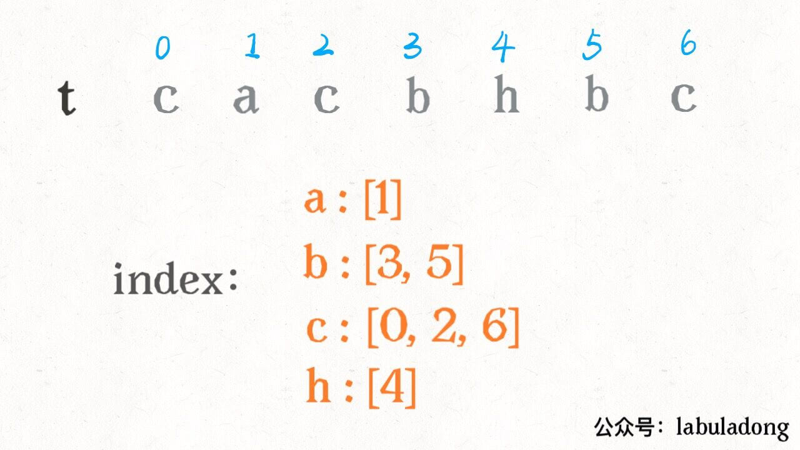

# 字符串

**题目**

| 序号/难度 | 名字 | 备注 |  |
| :--- | :--- | :--- | :--- |
| 剑指 Offer 20 |  表示数值的字符串 | 关键在于列出所有情况 | 恶心 |
| 剑指 Offer 67 | 把字符串转换成整数 | 关键在于考虑所有情况 | 记忆 |
| 459 | 重复的子字符串 | 双倍字符串+find函数的使用 | 巧解 |
| 1328 | 破坏回文串 | 有坑的题 | 小心 |
| 1249 | 移除无效的括号 | 字符串删除技巧 | 简单 |
| 自定义 | 高效判定字符串子序列 | 利用二分查找优化 | 记忆 |
| 面试01.03 | URL化 | 原地修改字符串 | 记忆，小坑 |
|  |  |  |  |

**原地修改字符串问题**

**示例：如果要把字符串的空格都替换成%20，那么如何高效修改？（面试题 01.03. URL化）**

什么叫高效修改？

* ①无额外空间开销：不需要开一个额外string存放
* ②无高开销的数组元素Insert：原地修改的话，对于vector与string进行插入操作是非常低效的，因为要移动后面所有字符，需要一种高效的原地修改方法

做法：预估长度 + 读写指针

* step1:（第一遍循环）先统计预估的最终字符串总长度，只需要知道多少空格就可以计算出长度
* step2:（第二遍循环，从后往前循环）尾部开辟出来第一步算出的多出来的长度
  * 双指针，一个指针在队尾表示writePos，另一个指针也是从后往前，但是表示readPos
  * 最终readPos必然会跟writePos相遇在string开头

这种做法是最高效的

**剑指 Offer20. 表示数值的字符串**

首先字符串只能是两种形式A\[.\[B\]\]\[e\|EC\]//.B\[e\|EC\] 

明确一些情况： 

* A带符号的整数；
* B无符号整数， 
* 小数点前后必有数字
* e后面必有一个（有符号）整数
* 空格只能出现在字符串首尾；

**剑指 Offer 67. 把字符串转换成整数**

**关键：**

以下四种字符需要考虑：

* **首部空格**： 删除之即可； 
* **符号位**： 三种情况，即 ''++'' , ''-−'' , ''无符号" ；新建一个变量保存符号位，返回前判断正负即可。
* **非数字字符**： 遇到首个非数字的字符时，应立即返回。 
* **数字字符**：遇到首个数字字符，处理完数字也直接返回
  * 字符转数字： “此数字的 ASCII 码” 与 “ 00 的 ASCII 码” 相减即可； 
  * 数字拼接： 若从左向右遍历数字，设当前位字符为 cc ，当前位数字为 xx ，数字结果为 resres ，则数字拼接公式为：

 **数字越界处理：**

 考虑数字越界问题。而由于题目指出 `环境只能存储 32 位大小的有符号整数` ，因此判断数字越界时，要始终保持 res在 int 类型的取值范围内。

```cpp
class Solution {
public:
    int strToInt(string str) {
        int i = 0, flag = 1;
        long res = 0; //默认flag = 1，正数
        while (str[i] == ' ') i ++;
        if (str[i] == '-') flag = -1;
        if (str[i] == '-' || str[i] == '+') i ++;
        for (; i < str.size() && isdigit(str[i]); i ++)  {
            res = res * 10 + (str[i] - '0');
            if (res >= INT_MAX && flag == 1) return  INT_MAX;
            if (res > INT_MAX && flag == -1) return  INT_MIN;
        } 
        return flag * res;
    }
};
```

**459. 重复的子字符串**

**题意：判断字符串是否是一个纯循环的字符串**

如果 s 中没有循环节，那么 s**+**s 中必然有且只有两个 s，此时从 \(s+s\)\[1\] 处开始寻找 s ，必然只能找到**第二个**，所以此时返回值为 s.size\(\)。

```cpp
bool repeatedSubstringPattern(string s) {
    return (s+s).find(s, 1)!=s.size();
}
```

**1328. 破坏回文串**

**代码见leetcode，破坏原则：**

①遇到a字符的话跳过，遇到不是a字符的话直接替换为a，返回

②如果全是a，替换最后一个为b就可以了

**③坑：如果长度为奇数，中间字符替换是没有用的，要注意！**

\*\*\*\*

**1249. 移除无效的括号**

**字符串一边遍历一边删除的技巧：用空格来替换被删除的字符**

**代码加leetcode**

\*\*\*\*

**自定义：高效判定字符串子序列（用字典来存字符是常用的trick\)**

**问题背景：**

如何判定字符串 `s` 是否是字符串 `t` 的子序列（可以假定 `s` 长度比较小，且 `t` 的长度非常大）。举两个例子：

s = "abc", t = "**a**h**b**gd**c**", return true.

s = "axc", t = "ahbgdc", return false.

这里`t` 的长度非常大，而且 给你一系列字符串 `s1,s2,...` 和字符串 `t`，你需要判定每个串 `s` 是否是 `t` 的子序列

**传统解法**：处理每个 `s` 时间复杂度是 **O\(N\)**， N 为 `t` 的长度，如果`t` 的长度非常大，效率会非常低

**优化解法：**利用下面建立`t`字符串字符的索引，处理每个`s` 时间复杂度降低，大约是 **O\(MlogN\)**。由于 N 相对 M 大很多，所以后者效率会更高。但是需要额外开销O\(N\)的空间，保存字符索引位置，**空间换时间**

（适用于需要判定很多个`s`字符串）

**解决办法：**

对 `t` 进行预处理，用一个字典 `index` 将每个字符出现的索引位置按顺序存储下来：

```cpp
int m = s.size(), n = t.size();
vector<vector<int>>index;
index.resize(256);
// 先记下 t 中每个字符出现的位置
for (int i = 0; i < n; i++) {
    char c = t[i];
    index[c].push_back(i);
}
```



这时候：s = "abc" 来匹配字符串`t`

* 查找a的index = 1
* 然后二分查找b中比1大的index的左边界（左边界二分查找模板），找到3
* 然后继续二分查找c中比3大的index的左边界，找到6

所以总共花费MlogN的复杂度，就可以找到字符串子序列

**代码实现**

```cpp
int left_bound(vector<int> &nums, int val){
    int l = 0, r = nums.size();
    while (l < r) {
        int mid = (l + r) / 2;
        if (val > nums[mid]) {
            l = mid + 1;
        } else {
            r = mid;
        } 
    }
    return l;
}
bool isSubsequence(string s, string t) {
    int m = s.size(), n = t.size();
    vector<vector<int>>index;
    index.resize(256);
    // 先记下 t 中每个字符出现的位置
    for (int i = 0; i < n; i++) {
        char c = t[i];
        index[c].push_back(i);
    }
    int j = 0; // 串 t 上的指针
    // 借助 index 查找 s[i]
    for (int i = 0; i < m; i++) {
        char c = s[i];
        if (index[c].empty()) return false;
        int pos = left_bound(index[c], j);// 二分搜索区间中没有找到字符 c
        if (pos == index[c].size()) return false;
        j = index[c][pos] + 1; // 向前移动指针 j
    }
    return true;
}
```


