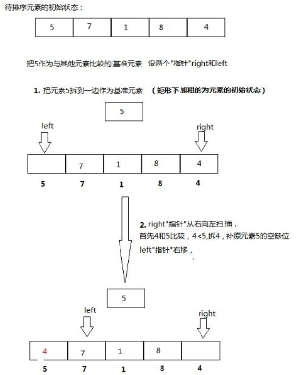
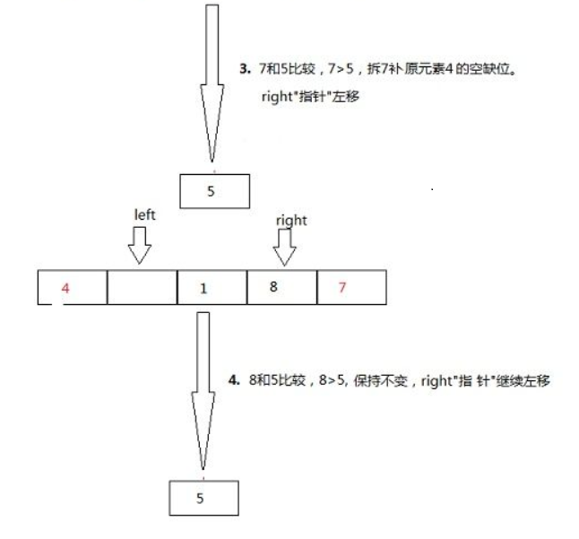
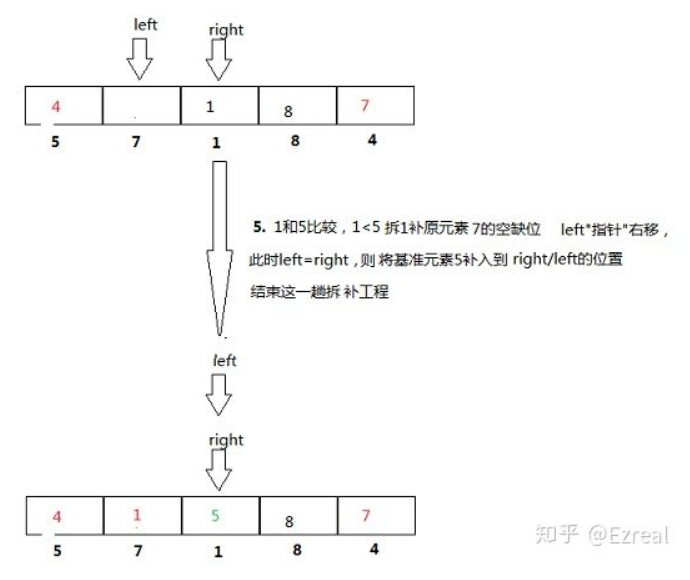

# 排序算法

## 快速排序

### **快速排序（6步）**

左右指针 + 分治的思路去理解

* step1: 初始条件：left指针（哨兵i）在最左边，right指针（哨兵j）在最右边，把left指针位置元素选做基准
* step2: 扫描：right指针（哨兵）从右到左扫描，与基准对比
* step3: 交换：如果right指针的值比left（基准）小，那么交换left，right指针（两哨兵）的值，使小的值尽量在前面。
* step4: 更换基准：基准被交换到right这边，基准就会被更换到right的位置，然后开始向左扫描left。
* step5: 终止条件：直到left==right（左右哨兵相遇）
* step6: 分治：左边，右边分别继续上述操作

### **复杂度：什么时候最坏，什么时候最好**

最好每次left,right都能在中间相遇，O\(NlogN\)

最差就是right扫的所有值都大于基准left的值，没有需要交换的，那么left,right相遇在最左边

（优化最差情况，就是基准值选取上，不要选过大或者过小的值）

**示例：**







代码：

```cpp
void sort(int a[], int left, int right) {
        if (left >= right) {
            return;
        }//每一趟结束的条件
        int i = left;
        int j = right;
        int temp = a[i]; // 第一个记录做基准元素
        while (i != j) { 
            //先从右边进行扫描，找到小于基准值的元素
            while (i < j && a[j] >= temp)
                j--;
            swap(a[i],a[j]);//找到之后交换
            //然后从左边扫描，找到大于基准值的元素，基准已经等于此时的a[j]
            while (i < j && a[i] <= temp)
                i++;
            swap(a[j],a[i]);//找到之后交换
        }
        sort(a, left, i - 1);
        sort(a, i + 1, right);
    }
```

### **快速排序的优化（4种）**

**\(1\).序列长度达到一定大小时，使用插入排序**

长度阈值设置为5-20之间

```cpp
void QSort(T arr[],int low,int high)
{
    int pivot;
    if (high - low + 1 < 10)
    {
        InsertSort(arr,low,high);
        return;
    }
    if(low < high)
    {
        pivot = Partition(arr, low, high);
        QSort(arr,low,pivot-1);
        QSort(arr,pivot+1,high);
    }
}
```

  
**\(2\).基准值的选取**

**基准值有三种选取策略**

* 固定基准
* 随机基准
* 三数取中（是一个相对优化的方法）

**三数取中代码：把中间值作为基准值，并把这个中间值移动到low的位置**

```cpp
int NumberOfThree(int arr[],int low,int high)
{
		int mid = low + ((high - low) >> 1);//右移相当于除以2
		if (arr[mid] > arr[high])swap(arr[mid],arr[high]);
		if (arr[low] > arr[high])swap(arr[low],arr[high]);
		if (arr[mid] > arr[low])swap(arr[mid],arr[low]);
		//此时，arr[mid] <= arr[low] <= arr[high]
		return arr[low];
}
```

**\(3\).尾递归优化**

快排算法和大多数分治排序算法一样，都有两次递归调用。但是快排与归并排序不同，归并的递归则在函数一开始， **快排的递归在函数尾部，这就使得快排代码可以实施尾递归优化。使用尾递归优化后，可以缩减堆栈的深度**，由原来的O\(n\)缩减为O\(logn\)。

**尾递归概念：**

如果一个函数中所有递归形式的调用都出现在函数的末尾，当递归调用是整个函数体中最后执行的语句且它的返回值不属于表达式的一部分时，这个递归调用就是尾递归。尾递归函数的特点是在回归过程中不用做任何操作，这个特性很重要，因为大多数现代的编译器会利用这种特点自动生成优化的代码。

**尾递归原理：**

当[编译器](https://baike.baidu.com/item/%E7%BC%96%E8%AF%91%E5%99%A8)检测到一个函数调用是尾递归的时候，它就覆盖当前的活动记录而不是在栈中去创建一个新的。编译器可以做到这点，因为递归调用是当前活跃期内最后一条待执行的语句，于是当这个调用返回时栈帧中并没有其他事情可做，因此也就没有保存栈帧的必要了。通过覆盖当前的栈帧而不是在其之上重新添加一个，这样所使用的栈空间就大大缩减了，这使得实际的运行效率会变得更高。

快排尾递归代码如下：

```cpp
template <class T>
void QSort(T arr[],int low,int high){
    int pivot;
    while(low < high){
        pivot = Partition(arr,low,high);       
        QSort(arr,low,pivot-1);        
        low = pivotPos + 1;    
    }
}
```

**第一次递归以后，变量low就没有用处了， 也就是说第二次递归可以用迭代控制结构代替**

 关于尾递归及快排尾递归优化可以看这篇博文：[尾递归及快排尾递归优化](https://blog.csdn.net/qq_38289815/article/details/105487879)

  
**\(4\).聚集元素（处理数组中有很多重复元素时，有比较大的提升）**

**详细：**[**https://blog.csdn.net/qq\_38289815/article/details/82718428\#%E4%BC%98%E5%8C%963%EF%BC%9A%E8%81%9A%E9%9B%86%E5%85%83%E7%B4%A0**](https://blog.csdn.net/qq_38289815/article/details/82718428#%E4%BC%98%E5%8C%963%EF%BC%9A%E8%81%9A%E9%9B%86%E5%85%83%E7%B4%A0)\*\*\*\*

聚集元素的思想：在一次分割结束后，将与本次基准相等的元素聚集在一起，再分割时，不再对聚集过的元素进行分割。把聚集元素都聚集在左边

普通过程例如：\[7\]\[2\]\[7\]\[1\]\[7\]\[4\]\[7\]\[6\]\[3\]\[8\] 由三数取中可得基准为\[7\]

第一趟：\[7\] \[2\] \[3\] \[1\] \[6\] \[4\] \[7\] \[7\] \[7\] \[8\]

第二趟：\[1\] \[2\] \[3\] \[4\] \[6\] \[7\] \[7\] \[7\] \[7\] \[8\]

第三趟：\[1\] \[2\] \[3\] \[4\] \[6\] \[7\] \[7\] \[7\] \[7\] \[8\]

第四趟：\[1\] \[2\] \[3\] \[4\] \[6\] \[7\] \[7\] \[7\] \[7\] \[8\]

聚集相同元素：

第一步：\[7\] \[7\] \[7\] \[1\] \[2\] \[4\] \[3\] \[6\] \[7\] \[8\]

第二步：\[6\] \[3\] \[4\] \[1\] \[2\] \[7\] \[7\] \[7\] \[7\] \[8\]

接下来是对\[6\] \[3\] \[4\] \[1\] \[2\] 和 \[8\]进行快排。

## **归并排序（分治算法）**


