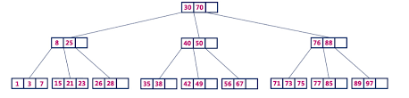
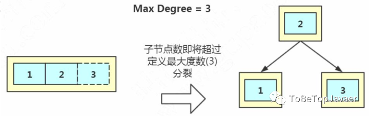

# B+树

又叫2-3树，2值3节点（一般默认是2-3）

* 每个节点可以有1个值，2个子节点
* 每个节点最多有2个值，3个子节点
* 中间节点可以存值
* 叶子节点可以最多有3个值

难点**：**

* 插入时破坏平衡性，如何调整
* 删除时破坏平衡性，如何调整

**分裂（添加节点）**

比如 Max Degree（路数）是 3 的时候，我们插入数据 1、2、3，在插入 3 的时候，本来应该在第一个磁盘块，但是如果一个节点有三个关键字的时候，意味着有 4 个指针，子节点会变成 4 路，所以这个时候必须进行分裂。把中间的数据 2 提上去，把 1 和 3 变成 2 的子节点。

**合并（删除节点）**

**注意（分裂与合并的最差情况）**：有时候可能会遇到，当分裂完一次后，上面的节点也满了，可能需要再次分裂，**最坏的情况**就是**连续分裂到根节点，根节点也是满的，需要再从根节点合并给别的子树，再不断合并下去**

