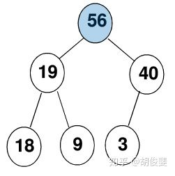
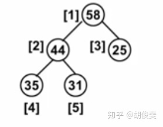
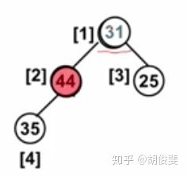
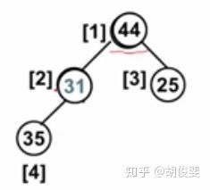
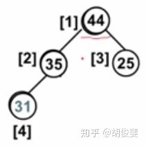
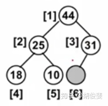
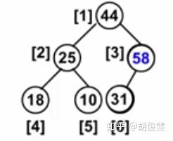
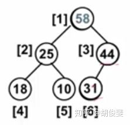

# 堆\(heap\)

### 定义

最大堆/最小堆

优先队列实现的数据结构就是堆

### 特性

**堆**通常是一个可以被看做一棵树的**数组对象**。

* **而这棵树一定是一棵完全二叉树**
* **如果他是最小树，则每个节点必定大于它的父节点**
* **如果是最大树则所有父节点一定大于它的儿子节点**
* **所以它的树根一定最大或者最小**

比如形如这样的最大堆：、



### **堆的结构**

**堆通常是一个可以被看做一棵树的数组对象”**，所以它的结构就并不是左指针和右指针了，而是以数组的形式，而且为了方便后面的操作（像插入、删除...），堆的结构中还有Size代表它当前的长度和Capacity代表它的总容量：

```cpp
struct HeapStruct{
    ElementType *Element;
    int Size;
    int Capacity;
};
```

### **创建堆**

创建一个空间的指针，再附上结构中的各个初值

### **删除堆**

**删除：**从二叉树的角度来看，我就先以最大堆为示例（最小堆其实是一样的）

既然叫做最大堆，肯定是从权值最大的删起，那就是从根节点删除一个节点（或者说弹出一个节点）。



这个时候我们要删除最大的元素，删除之后需要临时补上我们被删除的元素，可是因为这必须是一颗完全二叉树，所以我们不能贸然的随便移动节点，否则会引起不必要的麻烦，**所以我们将最后一个31先补在删除的位置，以保证完全二叉树的性质。**



然后我们会发现，我们的堆可能没有了之前的有序性，于是我们需要找到它儿子节点中比较大的那个，如果它比那个大的儿子小，就将它赋在儿子的位置上（需要保存它的值在一个开始变量中）。



然后继续做循环，直到所有儿子节点为空或者没有比它大的儿子。



### **插入堆**

删除为了不影响完全二叉树性质是在第一个位置，那么插入则是在最后一个位置：



假设值是58，由于比31（父节点）大。



然后在和父节点继续比较



得到最终结果，然后我们会发现一个问题，就是58会继续往上找，但是它并没有父节点怎么办呢？？我们的解决方法是设置一个**哨兵**，在所有堆的最上面（也就是数组的第0个元素），加一个一定比堆中所有值都大的数MAX就行啦~

### 实现代码

```cpp
#include <iostream>
#include <stdio.h>
#include <cstdlib>
#include <algorithm>
using namespace std;

#define MAX_SIZE 3000
#define MAX_DATA 99999999
typedef int KEY_TYPE;
struct MaxHeap{
    KEY_TYPE *data;
    int size;
    int capacity;
};

//创建堆
MaxHeap* createHeap(){
    MaxHeap* heap = (MaxHeap*)malloc(sizeof(MaxHeap));
    heap->data = (KEY_TYPE*)malloc((MAX_SIZE+1)*sizeof(KEY_TYPE));
    heap->size = 0;
    heap->capacity = MAX_SIZE;
    heap->data[0] = MAX_DATA; //预留一个最大值
    return heap;
}

bool isEmpty(MaxHeap* heap){
    return heap->size == 0;
}

bool isFull(MaxHeap* heap){
    return heap->size == heap->capacity;
}
//删除堆
KEY_TYPE deleteMaxHeap(MaxHeap* heap){
    if(isEmpty(heap)){
        printf("Empty!");
        return -1;
    }
    KEY_TYPE maxItem = heap->data[1];
    KEY_TYPE temp = heap->data[heap->size--];
    int child, parent;
    for(parent = 1; 2 * parent <= heap->size; parent=child){
        child = parent * 2;
        if(child != heap->size && heap->data[child+1] > heap->data[child])
            child++; //左右child中选择一个更大的子节点
        if(heap->data[child] > temp)
            heap->data[parent] = heap->data[child]; // 如果temp小于这个parent节点的child，交换parent与这个child，继续递归把child当parent
        else
            break;
    }
    heap->data[parent] = temp; //相当于把parent移到了最后，因为size-1就表示已经移除了
    return maxItem;
}

//插入堆
void insertMaxHeap(MaxHeap* heap, KEY_TYPE item){
    if(isFull(heap)){
        printf("Full!");
        return;
    }
    int i = ++heap->size; //最后的末尾节点作为temp
    heap->data[i] = item;
    for(;item > heap->data[i/2]; i = i / 2){
        heap->data[i] = heap->data[i/2]; //从末尾节点往上比较，如果比父节点大，就交换成为父节点
        heap->data[i/2] = item;
    }
}

int main(){
    MaxHeap* heap = createHeap();
    int vec[] = {100, 45, 23, 67, 4, -3, 118};
    const int length = sizeof(vec)/sizeof(int);
	  for(int i = 0; i< length;i++)
		    insertMaxHeap(heap, vec[i]);
    cout << deleteMaxHeap(heap) << endl;
    cout << deleteMaxHeap(heap) << endl;
    cout << deleteMaxHeap(heap) << endl;
    cout << deleteMaxHeap(heap) << endl;    
}   
```

测试结果：

```cpp
118
100
67
45
```

