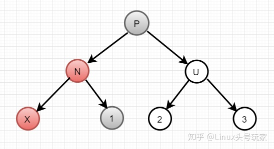

# 红黑树\(rbtree\)

参考：[https://zhuanlan.zhihu.com/p/189561599](https://zhuanlan.zhihu.com/p/189561599)

### 应用场景

* C++STL中的std::map, std::set\(又叫树状数组，有序集合/映射\)\(std::unordered\_map与std::unordered\_set都是哈希表\)
* nginx用来管理timer
* epoll中用红黑树管理事件块（文件描述符）
* Linux进程调度Completely Fair Scheduler\(CFS\)用红黑树管理进程控制块，vruntime利用红黑树来进行存储
* Linux内核内存的vm\_area\_struct通过红黑树组织

### 提出目的

红黑树是为了解决平衡树在插入、删除等操作需要频繁调整的情况

### 特性（规则）

* 1.具有二叉查找树的特点。
* 2.节点是红色或者黑色，**根节点是黑色**，**叶子节点都是黑色的空节点**（叶子节点不存数据）
* 3.任何相邻的节点都不能同时为红色
  * 也就是说，**红色节点**是**被黑色节点隔开的**。
  * 或者说，每个红色节点必须有两个黑色的子节点
* 4.从任一节点到其每个叶子\(NIL\)的**所有简单路径都包含相同数目的黑色节点**
  * 所以决定了红黑树中最长路径最多是最短路径的两倍

事实上，如上所有的规则都只想做一件事，**让二叉树尽可能的平衡**。

不可能出现两个连续的红色节点，也就是说支树上最多是红黑交替的情况，即代表红黑树中最长路径最多是最短路径的两倍。

示例：下图就是红黑树，最短路径是55-45，也就是2，最长路径是55-107，也就是4，刚好符合标准


### 为什么有了平衡树还需要红黑树

关键：**红黑树不用严格控制高度，使得插入，删除效率更高，不会频繁调整**

**平衡树**解决了二叉查找树退化为近似链表的缺点，能够把查找时间控制在 O\(logn\)，不过却不是最佳的，因为平衡树要求**每个节点的左子树和右子树的高度差至多等于1**，这个要求实在是太严了，导致每次进行插入/删除节点的时候，几乎都会破坏平衡树的这个规则， 进而我们都需要通过**左旋**和**右旋**来进行调整，使之再次成为一颗符合要求的平衡树。

 **红黑树在插入、删除**等操作，**不会像平衡树那样，频繁着破坏红黑树的规则，所以不需要频繁着调整**，这也是我们为什么大多数情况下使用红黑树的原因。

单单在**查找方面的效率的话，平衡树比红黑树快**。

**红黑树不用严格控制高度，使得插入，删除效率更高。**

所以，我们也可以说，**红黑树是一种不大严格的平衡树**。也可以说是一个**折中方案**。

### 理解：**类比2-3-4树，红黑树本质其实就是对概念模型2-3-4树的一种实现**

**2-3-4树**

本质是B树\(B树叫2-3树\)的四阶形式，就是最多有4个节点

所以它会存在以下节点：

* 2节点，存放1个值
* 3节点，存放2个值
* 4节点，存放3个值

#### **红黑树本质其实就是对概念模型2-3-4树的一种实现**

由于直接进行不同节点间的转化会造成较大的开销，所以选择以二叉树为基础，在二叉树的属性中加入一个**颜色属性**来表示2-3-4树中不同的节点。

* 2-3-4树中的**2节点**对应着红黑树中的**黑色节点**
* 2-3-4树中的非2节点是以**红节点+黑节点**的方式存在
* 2-3-4树中的**3节点**对应着红黑树中的
* 2-3-4树中的**4节点**对应着红黑树中的

按照类似的思路理解，**一个左倾红黑树**就是可以**转换为一个2-3树**


#### 红黑树的5条定义转换为2-3-4树都是符合的

#### **1.节点颜色有红色和黑色**

#### **2.根节点必为黑色**

#### **3.所有叶子节点都是黑色 此处提到的叶子其实是空链接** 

**4.任意节点到叶子节点经过的黑色节点数目相同**

#### **5.不会有连续的红色节点**

**插入**


**删除**


**2-3-4树与红黑树对应点：**

* 红黑树在插入的时候**一定插入红色节点，红色节点就是黑色父节点的子节点**
  * **向2-3树中的2节点插入一个元素**，只需要简单的把2节点变成3节点，对应的就是在**黑色父节点下面增加一个红色儿子**，确实不会违背红黑树的任何规则
  * 有些时候，之所以**需要在插入后进行调整**，正是因为可能存在着**概念模型中的临时4节点**（反应在红黑树中是双红的情况）
* 对于2-3树的删除
  * 如果待删除元素在3节点，那么可以直接将这个元素删除，而不会破坏2-3树的任何性
  * 如果删除元素在2节点的时候，由于删除这个元素会导致2节点失去自己**唯一的元素**
    * 就从它的兄弟节点或者它的父节点借一个元素，使得当前节点由2节点成为一个3节点或者一个临时4节点

**（所有插入与删除的原则：本质都是维持2-3-4树的平衡，将红黑树转换成2-3-4树来理解！！）**

[https://www.zhihu.com/question/312327402/answer/1560653215](https://www.zhihu.com/question/312327402/answer/1560653215)

### 红黑树的插入

与平衡二叉树是类似的，也需要先按照二叉搜索树的原则插入，之后维护平衡

**示例：**\(其中一种可能的示例，并不代表通例）刚插入的节点为X，它的父节点为N，祖父节点为P，N的兄弟节点为U，下图列举了一种可能的情况：（需要分多种情况去讨论）

注意：这里P只是一个节点，并不是根节点

其中红底的代表红节点，黑底的代表黑节点，白底的代表颜色未知的节点（即可黑可红）


**红黑树中规定，新插入的节点一定是红色**

**PS：2-3-4树分析法（推荐！！）**

 ****转成2-3-4树来分析，插入的是**红色节点**，分析插入的是**2节点** or **3节点** or **4节点**

* **N为黑色**就代表插入的是**2节点**，不用调整
* **N为红色，P为黑色，U不是红色**就代表插入的是**3节点**，这时候需要变成4节点，那么**N要变为黑色**，**P要变为红色，N的右树要跑到P的左边**
* **N为红色，P为黑色，U为红色**就代表插入的是**4节点，这时候需要分裂，分成两个3节点（两个左偏）N变为黑色，P变为红色，U变为黑色，这时候因为多了一个节点（在红黑树里说，就是因为P变为红色）可能会导致上面的结构也需要分裂，就要一直调整到根部再调整到尾部为止**

**普通分析法（很复杂！！）**

**情况1：** **N为黑色**

这种情况最简单，不需要任何调整，插入红色节点并不影响路径上黑色节点的数量，因为N为黑色，也可以保证不会出现连续红色

**情况2：** **N为红色**

时出现了X和N为两个连续的红节点，需要调整树，让它符合红黑树的特征

情况2.1：N为P的左节点，X为N的左节点 

情况2.2：N为P的左节点，X为N的右节点

情况2.3：N为P的右节点，X为N的右节点

情况2.4：N为P的右节点，X为N的左节点

其实前面两种和后面两种是成镜像的，也就是说分析前两种，后面两种的操作可以效仿前两种

可以做的操作有：左旋，右旋，节点颜色修改等，从而让树重新符合红黑树的特征

**情况2.1：N为P的左节点，X为N的左节点** 



这种情况我们就需要分析U节点的颜色

**情况2.1.1：U节点为红色**

直接把N和U全部设置为黑色，把P设置为红色即可


所以插入后，假设P节点，之前有a个黑色节点，在到达X,1,2,3这四个节点的时候，经过黑色节点的数量如下（这时候还没有按照上述操作改变）：

```text
X节点：a + 1
1节点：a + 2
2节点：a + 2
3节点：a + 2
```

在改变之后

```text
X节点：a + 1
1节点：a + 2
2节点：a + 2
3节点：a + 2
```

所以改变前后依然符合红黑树的特征：也就是经过路径的黑色节点个数相等

**情况2.1.2：U节点为黑色**

首先对**P节点进行右旋**，然后**交换N和P节点的颜色**


同样按照上述操作，设到达P节点之前，有a个黑色节点。在改变之前，在到达X,1,2,3这四个节点的时候，经过黑色节点的数量如下，\(因为2，3节点的颜色未知，所以用d2,d3代表。比如说如果2为黑，d2则为1，否则为0\)：

```text
X节点：a + 1
1节点：a + 2
2节点：a + 2 + d2
3节点：a + 2 + d3
```

改变之后

```text
X节点：a + 1
1节点：a + 2
2节点：a + 2 + d2
3节点：a + 2 + d3
```

可以发现改变之后还是符合红黑树的特征

**情况2.2：N为P的左节点，X为N的右节点**


首先**左旋N节点**

同理分析在改变之前，在到达1,2,3,4,5这五个节点的时候，经过黑色节点的数量如下

```text
1节点：a + 2
2节点：a + 2 + d2
3节点：a + 2 + d3
4节点：a + 2
5节点：a + 2
```

改变之后

```text
1节点：a + 2
2节点：a + 2 + d2
3节点：a + 2 + d3
4节点：a + 2
5节点：a + 2
```

可以看出，并没有改变支路上黑节点的数量。但是N,X还是两个连续的红节点，还要继续操作。观察到**上图被红色方框圈出来的东西**发现，它就是之前**情况2.1：N为P的左节点，X为N的左节点**的那种情况，所以可以转到对应的步骤处理。

**情况2.3：N为P的右节点，X为N的右节点**

对应**N为P的左节点，X为N的左节点**，把右旋换成左旋，其他步骤一样。  


**情况2.4：N为P的右节点，X为N的左节点**

对应**N为P的左节点，X为N的右节点**，把右旋换成左旋，其他步骤一样。

### 红黑树的**删除**

**先按照普通二叉树的删除算法：**

1. 定位到二叉树需要删除的节点
2. 如果节点没有支树了，直接删除节点
3. 如果节点只有一个子支树，直接把这个子支树跟需要删除的节点的父节点相连
4. 如果节点有两个支树，找到节点的**右支树的最小值**，然后把这个值赋值给需要删除的节点**。**然后再删除掉拥有**右支树的最小值**的这个节点，因为这个节点是右边最小的了，那么它的左分支肯定为空，也就是说最多只可能有一个支树。这时候我们可以转换为**情况2/3**处理了。

**红黑树的删除：先按照二叉树的方式删除，然后再保持平衡**

示例：假设一个节点P，删除了它的一个子节点X，删除完成之后，N节点顶替掉了X节点，成为P的子节点。X节点的兄弟节点为S，S的左右节点为SL，SR。

**PS: 2-3-4树分析法，推荐！**

**普通分析法**

**情况1：被删除的X节点没有分支**

这种情况直接删除节点就好了，删除一个没有分支的节点，是不会影响红黑树的特性的

**情况2：被删除的X节点有一个分支**

这个时候的切入点就是被删除节点的颜色

**情况2.1：被删除的X节点为红色**

这种情况也不需要调整，X节点为红色，那么X的父节点P必为黑色，所以N节点为红还是黑都不会导致连续两个红色，另外路径上也只是少了一个红节点，也不会影响路径上的黑色节点数目

**情况2.2：被删除的X节点是黑色**

需要继续分析子节点的颜色

**情况2.2.1：N节点为红**


这种情况直接把N染成黑色就可以了，不仅N不会和P产生两个连续红节点的情况，而且经过N节点的路径多了一个黑节点，正好替代被删除的黑节点X。

**情况2.2.2：N节点为黑**

从S节点的颜色开始分析

**情况2.2.2.1：** **S节点为红色**

因为S为红色，根据红黑树的定义，P，SL，SR肯定都是黑色

这里我们把P节点进行左旋，然后交换S和P节点的颜色


上面的S节点为P节点的右节点，所以左旋P节点。如果S节点为P节点的左节点，则是右旋P节点。 分析N，SL，SR节点在操作前和操作后的路径经过的黑色节点数量，发现都没有改变。

**情况2.2.2.2：S节点为黑色，SR节点为红**


由于原来P的左边有一个黑节点X，现在被删除了，所以左边路径上少了一个黑节点。 这种情况，直接左旋P节点，然后交换P,S的颜色，并且把SR换成黑色。


上面的S节点为P节点的右节点，所以取了SR来举例子。如果S为P节点的左节点，那么就应该去SL。然后把左旋改成右旋。 通过如上操作，不难发现，经过N节点的路径的黑色节点数量多了一个，而经过SL,SR节点的路径的黑色节点并没有变少，符合红黑树特征

**情况2.2.2.3：S节点为黑色，SR节点为黑**

这种情况下只剩下P节点和SL节点的颜色没有确定，这两个节点的组合，总共可能有四种情况：

1. **情况2.2.2.3.1** P为黑，SL为黑色
2. **情况2.2.2.3.2** P为白，SL为黑
3. **情况2.2.2.3.3** P为黑，SL为白
4. **情况2.2.2.3.4** P为白，SL为白


* 对于第一种和第二种情况，都是转换成如下的情况：


**第一种**是直接把S变成红色。然后P的左右支树的节点数量一样（P的左子树少了个黑色节点X）。  
但是对于经过P节点的支路上来说，全部都少了一个黑节点（比如经过SL和SR节点的支路）。  
所以可以把P节点看成N节点，进行递归，分析P节点的父节点，兄弟节点。如果中途一直没有解决，则会递归到根节点。如果根节点此时为红色，则变回黑色。、  
**第二种**直接把P和S节点的颜色对调，就不需要再调整了。因为对于经过N节点的支路多了一个黑节点，对于SL，SR来说没有变，正好符合情况。  
**第三种**和**第四种**其实都是对S节点进行右旋，然后交换SL和S的颜色最后转化成**S节点为黑色，SR节点为红**的情况。


### 红黑树理解与性能分析

红黑树属于**平衡二叉树**。 说它**不严格**是因为它**不是严格控制左、右子树高度或节点数之差小于等于1**。 但红黑树高度依然是**平均log\(n\)**，且**最坏情况高度不会超过2log\(n\)**

某种意义上，**红黑树利用了缓存**

红黑树等价于2-3**-**4树


 其中2-节点 等价于普通平衡二叉树的节点，**3-节点 本质上是非平衡性的缓存**。

 当需要再平衡（rebalance）时，增删操作时，2-节点 与 3-节点间 的 转化会吸收不平衡性

减少旋转次数，使再平衡尽快结束。

 **在综合条件下，增删操作相当时，数据的随机性强时，3-节点的非平衡性缓冲效果越明显。因此红黑树的综合性能更优。**

**总的来说，** 红黑树的性能优势，**本质上是用空间换时间**

（有非官方实验表明，**优化过的AVL树**与**Linux的rbtree**在插入删除性能上差异也没有那么明显）


