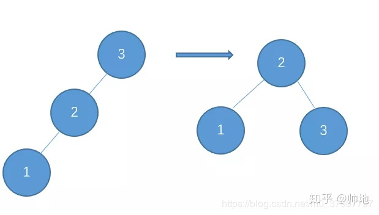
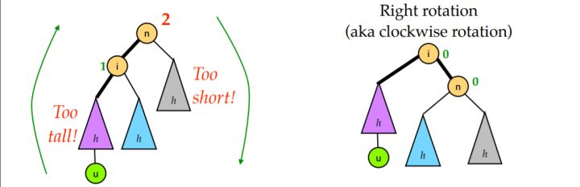
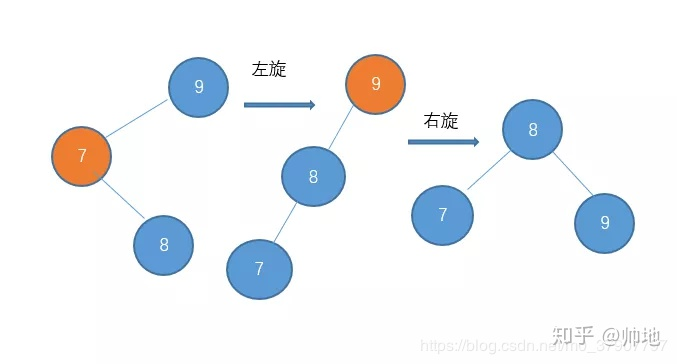
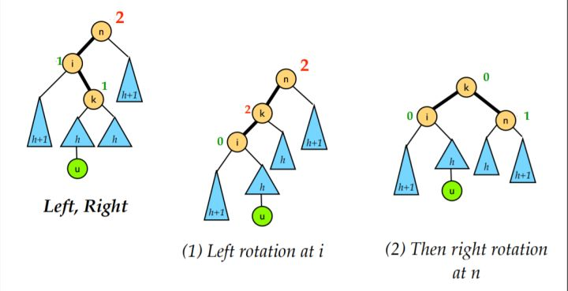

# 平衡二叉树\(AVL\)

### 提出目的

解决顺序插入二叉搜索树会导致最差情况下，查询需要O\(n\)复杂度，相当于链表

### 特性

1. 具有二叉查找树的全部特性。（左边的小于中间，右边的大于中间）
2. 每个节点的左子树和右子树的高度差至多等于1。

注意：这里的高度差小于等于1，需要与 **完全二叉树** 区分

平衡二叉树存在下面的情况，这种也是**平衡二叉树！！**

```text
       4
      / \
     2   6
      \ / \
      3 5  7
            \
             8
2的另一边虽然比8的长度小2，但是还是符合平衡二叉树的定义
```

### 基本操作

**查询**

保证查询稳定在O\(logN\)

**维护（插入/删除）**

**插入的四种类型（不平衡的四种类型）：**

**1.LL型：右旋**



完整的过程：

在更长的子树添加了一个节点，导致树不平衡（注意：蓝色子树的移动）

对节点 n 右旋一次即可



**2. RR型：左旋**   

RR 型的情况和 LL 型完全对称。只需要对节点 n 进行一次左旋即可修正

**3. LR型：先左旋再右旋**  





LR 就是将新的节点插入到了 n 的左孩子的右子树上导致的不平衡的情况。

这时我们需要旋转两次：

* 先对 i 进行一次左旋
* 再对 n 进行一次右旋

**4. RL型：先右旋再左旋**

类似于上面的LR的情况

### 最坏情况下，插入删除旋转次数

**插入**时都可以被归结为上面的四种类型，所以插入的**最坏情况就是两次，复杂度依旧是O\(logN\)**

例如下面的例子来看：

```text
  z         
 /  \       
T1   y     
    /  \   
   T2   x  
       / \
     T3   w
         / \
        T4 T5
        
插入T5，可能会导致不平衡
例如：原本T5(T5底部到z） = T1(T1底部到z)+ 1，现在插入后T5比T1长2了，这时候需要调整平衡

根据下面的insert代码分析：
插入T5后，会在往上回溯的时候rebalance，所以从T5开始从底部往根节点看
T5：插入后T5 = T5 + 1
T4；如果T4本来就是平衡树相对较短的分支(深度少1的分支）T5+1必然会导致不平衡，所以T4-w-T5左旋
T3：- 如果前面T4的时候已经旋转过了，那么T3一定与T4,T5所在分支平衡
    - 如果经过T4的时候没有调整，T3类似于之前的T4情况，原本相对于T5深度少1，
      T5+1必然会导致不平衡，所以T3-x-w左旋
      旋转后对于T4深度还是不变，不会影响原平衡
T2：同T3
T1：- 如果前面T2,T3,T4有一个环节左旋，那么T1都不需要左旋
    - 如果前面没有左旋，原本T5分支就比T1分支的高度多1，现在插入后T5比T1长2了，所以T1-z-y需要左旋
      左旋后T2前后不变不会影响平衡
      T3，T4都会减1，但是与T5的高度差不变，前面回溯的时候都可以平衡，所以现在当然也可以平衡

总的来说，只需要一次左旋（对于RR型），需要两次 左旋+右旋（对于LR型）
         不用logN的旋转次数，因为递归的时候必要时中间旋转一次就足够了

RR
  z                                y
 /  \                            /   \ 
T1   y     Left Rotate(z)       z      x
    /  \   - - - - - - - ->    / \    / \
   T2   x                     T1  T2 T3  w
       / \                              / \
     T3   w                            T4 T5
         / \
        T4 T5
```

**删除**时最坏情况**logN次旋转，复杂度是O\(logN\)**

```text
  z                            
 /  \               
T1   y     
    /  \   
   T2   x  
       / \
     T3   w
         / \
        T4 T5
        
删除T5的一个节点，导致T4比T5长度多2
原本T4(T4底部到z） = T5(T5底部到z)+ 1，现在T5-1后T4比T5长2了

根据delete代码的rebalance分析：
同样从T5开始，从底部往根节点看
T4：右旋T4-w-T5后，T4与T5平衡了，但是T4，T5所在的分支w高度减少了1
T3：因为T4 T5的w分支高度减少了1，所以如果本身T3就比T4高度多1，可能又与T3高度相差了2, 还需要旋转
T2：类似于上面T3的情况，这种旋转操作需要一直持续到根节点T1

所以最差需要logN次的旋转操作
```

### 代码

* 节点的定义（存储data，height，\*left，\*right）
* 得到树的高度属性 O\(1\)（存储在节点中，不需要额外计算）
  * 注意:高度属性不等于深度，是深度的相反, 会出现一些高度断层，例如：子节点比父节点height小2，也正常！！
  * 与之对应地，我们在进行如下操作时需要更新受影响的所有节点的高度：
    1. 在插入结点时， 沿插入的路径更新结点的高度值
    2. 在删除结点时（delete）,沿删除的路径更新结点的高度值
    3. 左旋右旋的时候
* 得到树的平衡因子 O\(1\)（直接根据高度就可以计算出来）
* 左旋操作 O\(1\)
  * 两个操作：
    * root-&gt;right = right-&gt;left
    * right-&gt;left = root
  * 需要更新深度，先更新root，再更新right
* 右旋操作 O\(1\)
  * 两个操作
    * 类似于上面
  * 需要更新深度，先更新root，再更新left
* 平衡化操作 O\(1\)
  * 如果出现不平衡的现象
    * 四种类型判断
* Insert node \(递归 logN）
  * 关键：什么时候更新height
* delete node \(递归 logN）
  * 关键：什么时候更新height
  * 有一个deleteMin的现象：就是需要删除当前root的节点，需要把右子树的最小节点值更新上来，然后把那个最小节点删除了
* deleteMin \(删除一个子树中最小的节点\)，用在delete node中


```cpp
// AVL.cpp

#include <iostream>
#include <stdio.h>
#include <algorithm>
using namespace std;

typedef int KEY_TYPE;
struct Node {
    KEY_TYPE data;
    int      height;
    Node     *left;
    Node     *right;
    Node(KEY_TYPE x): data(x), height(0), left(NULL), right(NULL) {};
};

//树的高度
int getHeight(Node* root) {
    return (root==NULL)?-1:root->height;
}

//计算平衡因子
int treeGetBalanceFactor(Node* root) {
    if(root == NULL)
        return 0;
    else
        return getHeight(root->left) - getHeight(root->right);
}

//右旋
Node* treeRotateRight(Node* root) {
    Node* left = root->left;

    root->left = left->right; // 将将要被抛弃的节点连接为旋转后的 root 的左孩子
    left->right = root; // 调换父子关系

    root->height = max(getHeight(root->left), getHeight(root->right)) + 1;//注意这里也要先更新root再更新left，因为其实root是left的子节点
    left->height = max(getHeight(left->left), root->height) + 1;
    
    return left;
}

//左旋
Node* treeRotateLeft(Node* root) {
    Node* right = root->right;

    root->right = right->left;
    right->left = root;
    
    root->height = max(getHeight(root->left), getHeight(root->right)) + 1;//注意这里同样也要先更新root再更新right
    right->height = max(getHeight(right->right), root->height) + 1;

    return right;
}

//调整平衡，针对于4种情况
Node* treeRebalance(Node* root) {
    int factor = treeGetBalanceFactor(root);
    if(factor > 1 && treeGetBalanceFactor(root->left) > 0) // LL
        return treeRotateRight(root);
    else if(factor > 1 && treeGetBalanceFactor(root->left) <= 0) { //LR
        root->left = treeRotateLeft(root->left);
        return treeRotateRight(root);
    }else if(factor < -1 && treeGetBalanceFactor(root->right) <= 0) // RR
        return treeRotateLeft(root);
    else if(factor < -1 && treeGetBalanceFactor(root->right) > 0) { // RL
        root->right = treeRotateRight(root->right);
        return treeRotateLeft(root);
    }else{
        return root;
    }
}

//插入元素
Node* treeInsert(Node* root, KEY_TYPE value)
{
    if(root == NULL) {
        //Node* newNode = (Node*)malloc(sizeof(Node)); //注意：这里的sizeof(Node)肯定与sizeof(Node*)是不一样的
        //newNode->data = value;
        //newNode->left = newNode->right = NULL;
        root = new Node(value);
    }else if(root->data < value)
        root->right = treeInsert(root->right,value);
    else
        root->left = treeInsert(root->left,value);
    root->height = max(getHeight(root->left), getHeight(root->right)) + 1; // 更新高度，专门针对于没有旋转操作的时候更新高度
    root = treeRebalance(root);
    return root;
}
//声明
Node* treeDelete(Node *root, KEY_TYPE value);

//删除节点的时候删除最小值
KEY_TYPE treeDeleteMin(Node* root)
{
    Node* temp = root;
    while(temp->left)
        temp = temp->left;
    KEY_TYPE value = temp->data;
    root = treeDelete(root, value);
    return value;
}

Node* treeDelete(Node *root, KEY_TYPE value)
{
    Node *toFree; 
    if(root) {
        if(root->data == value) {
            if(root->right) {
                root->data = treeDeleteMin(root->right);
            } else {
                toFree = root;
                root = toFree->left;
                delete(toFree);
            }
        }else if(root->data < value)
            root->right = treeDelete(root->right, value);
        else
            root->left = treeDelete(root->left, value);
        if(root)root->height = max(getHeight(root->left), getHeight(root->right)) + 1; //这里需要加一个判定因为很可能删除完之后root就等于null了
        root = treeRebalance(root);
    }
    return root;
}
//中序遍历：输出树的结构
void inOrder(Node* root)
{
	if(root){
		inOrder(root->left);
		printf("key: %d height: %d ", root->data, root->height);
		if(root->left)
			printf("left child: %d ", root->left->data);
		if(root->right)
			printf("right child: %d ", root->right->data);
		printf("\n");
		inOrder(root->right);
	}
}
//测试代码
int main(int argc, char* argv[]){
    Node* root = NULL;
	int vector[] = {1,2,3,4,5,6,7};
	const int length = sizeof(vector)/sizeof(int);
	for(int i = 0; i< length;i++)
		root = treeInsert(root, vector[i]);
	
	printf("\nInOrder: \n");
	inOrder(root);
    root = treeInsert(root, 8);
    printf("\nInOrder: \n");
	inOrder(root);
    root = treeDelete(root, 1);
	printf("\nInOrder: \n");
    inOrder(root);
    root = treeDelete(root, 8);
    printf("\nInOrder: \n");
    inOrder(root);
    root = treeDelete(root, 4);
    printf("\nInOrder: \n");
    inOrder(root);
	return 0;
}
```

测试结果：

```cpp
InOrder:
key: 1 height: 0
key: 2 height: 1 left child: 1 right child: 3
key: 3 height: 0
key: 4 height: 2 left child: 2 right child: 6
key: 5 height: 0
key: 6 height: 1 left child: 5 right child: 7
key: 7 height: 0

InOrder:
key: 1 height: 0
key: 2 height: 1 left child: 1 right child: 3
key: 3 height: 0
key: 4 height: 3 left child: 2 right child: 6
key: 5 height: 0
key: 6 height: 2 left child: 5 right child: 7
key: 7 height: 1 right child: 8
key: 8 height: 0

InOrder:
key: 2 height: 1 right child: 3
key: 3 height: 0
key: 4 height: 3 left child: 2 right child: 6
key: 5 height: 0
key: 6 height: 2 left child: 5 right child: 7
key: 7 height: 1 right child: 8
key: 8 height: 0

InOrder:
key: 2 height: 1 right child: 3
key: 3 height: 0
key: 4 height: 2 left child: 2 right child: 6
key: 5 height: 0
key: 6 height: 1 left child: 5 right child: 7
key: 7 height: 0

InOrder:
key: 2 height: 1 right child: 3
key: 3 height: 0
key: 5 height: 2 left child: 2 right child: 6
key: 6 height: 1 right child: 7
key: 7 height: 0

```

### 平衡树的回溯优化

AVL 插入和删除并不一定需要回溯到根节点，两种情况下可以直接退出向上回溯：

1. 插入更新时：如果当前节点的高度没有改变，则停止向上回溯父节点。
2. 删除更新时：如果当前节点的高度没有改变，且平衡值在 \[-1, 1\] 区间则停止回溯。

