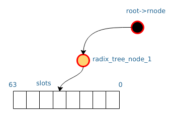

# RadixTree

### **基数树**

也称压缩前缀树，提供key-value存储查找的数据结构

**主要负责查找key**

与Trie不同的是，它对Trie树进行了空间优化，只有一个子节点的中间节点将被压缩。

**示例：**

romane、romanus、romulus、rubens、ruber、rubicon、rubicundus


**插入的时候可能需要分裂节点，删除的时候可能需要合并节点**

例如在下面这个树中插入单词rubens


需要分割原来的“rom”节点


### **Linux内核实现Radix树**

**主要功能：存储key \(id）,并且允许高效搜索和插入**

```cpp
struct radix_tree_node {
	unsigned char	shift;		/* Bits remaining in each slot */
	unsigned char	offset;		/* Slot offset in parent */
	unsigned char	count;		/* Total entry count */ 
	unsigned char	exceptional;	/* Exceptional entry count */
	struct radix_tree_node *parent;		/* Used when ascending tree */
	struct radix_tree_root *root;		/* The tree we belong to */
	union {
		struct list_head private_list;	/* For tree user */
		struct rcu_head	rcu_head;	/* Used when freeing node */
	};
	void __rcu	*slots[RADIX_TREE_MAP_SIZE];
	unsigned long	tags[RADIX_TREE_MAX_TAGS][RADIX_TREE_TAG_LONGS];
};

struct radix_tree_root {
        spinlock_t              xa_lock;
        gfp_t                   gfp_mask;
        struct radix_tree_node  __rcu *rnode;
};
```

以下图为例



*  `RADIX_TREE_MAP_SHIFT`等于6, `RADIX_TREE_MAP_SIZE`则等于2^6 = 64，每个节点的slots可以插入64个节点或item;
* unsigned char shift;
* * 
**insert示例**

```cpp
static struct radix_tree_root _root;
static struct node node0 = { .name = "Sourcelink", .id = 32 };
INIT_RADIX_TREE(&_root, GFP_ATOMIC);
radix_tree_insert(&_root, node0.id, &node0);
```

