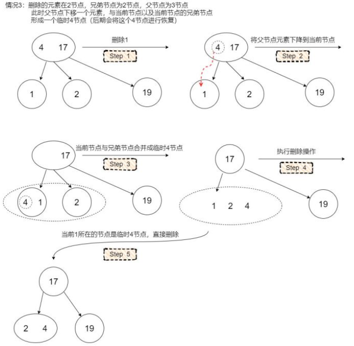

# RadixTree

### **基数树**

也称压缩前缀树，提供key-value存储查找的数据结构

**主要负责查找key**

与Trie不同的是，它对Trie树进行了空间优化，只有一个子节点的中间节点将被压缩。

**示例：**

romane、romanus、romulus、rubens、ruber、rubicon、rubicundus



**插入的时候可能需要分裂节点，删除的时候可能需要合并节点**

例如在下面这个树中插入单词rubens


需要分割原来的“rom”节点


### **Linux内核实现Radix树**

**主要功能：存储key \(id）,并且允许高效搜索和插入**

```cpp
struct radix_tree_node {
	unsigned char	shift;		/* Bits remaining in each slot */
	unsigned char	offset;		/* Slot offset in parent */
	unsigned char	count;		/* Total entry count */ 
	unsigned char	exceptional;	/* Exceptional entry count */
	struct radix_tree_node *parent;		/* Used when ascending tree */
	struct radix_tree_root *root;		/* The tree we belong to */
	union {
		struct list_head private_list;	/* For tree user */
		struct rcu_head	rcu_head;	/* Used when freeing node */
	};
	void __rcu	*slots[RADIX_TREE_MAP_SIZE];
	unsigned long	tags[RADIX_TREE_MAX_TAGS][RADIX_TREE_TAG_LONGS];
};

struct radix_tree_root {
        spinlock_t              xa_lock;
        gfp_t                   gfp_mask;
        struct radix_tree_node  __rcu *rnode;
};
```

### 插入原理

**insert示例**

```cpp
static struct radix_tree_root _root;
static struct node node0 = { .name = "Sourcelink", .id = 32 };
INIT_RADIX_TREE(&_root, GFP_ATOMIC);
radix_tree_insert(&_root, node0.id, &node0);

//函数定义：
int radix_tree_insert(struct radix_tree_root *root, 
                      unsigned long index, void *entry)
- root是radix_tree的根节点
- 如果现有树中的node没法放下，在insert函数内部会创造radix_tree_node节点
- entry是指item节点
```


*  `RADIX_TREE_MAP_SHIFT`等于6, `RADIX_TREE_MAP_SIZE`则等于2^6 = 64，每个节点的slots可以插入64个节点或item;
*  刚开始插入`root->rnode`节点还为空 , 则无需通过`radix_tree_extend()`扩展深度, 
*  假设现在有个ID为32的item需要插入, 再经过第④步的计算, 将其插入`radix_tree_node_1`节点的slots的**offset为32**的位置

**扩展深度示例：**

现在有个ID为64的item需要插入, 则需要再**新增扩展树的深度**，之前只放0-63  
****


为了新插入的item需要合适的位置插入, 而新增了两个节点`radix_tree_node_2`和`radix_tree_node_3`

`radix_tree_node_1`节点则插入`radix_tree_node_2`节点**slots的offset为0**的位置

`radix_tree_node_3`节点则插入`radix_tree_node_2`节点**slots的offset为1**的位置

id=64，item则插入`radix_tree_node_3`节点slots的offset为0的位置;

只要ID的**范围在 2^12 = 4096内都无需再扩展树的深度**, 只需在对应的slot挂载节点后插入item;

插入一个ID为1596的item, 图解如下


### 查询原**理**

**①**首先是**根据ID**进行对应item查找, 计算了当前树最大**ID范围**

如果要查找的ID值超过该范围, 则说明该ID对应item不在该树中;

②: 根据index从父节点开始获取存储了item的叶子节点node**\(通过while循环\)**, 因为前面插入分析可以知道item都存储在叶子节点的slots中;

**只用循环最末尾叶子节点的Radix\_tree\_node中的item节点**

### **删除原理**

**涉及到radix\_tree\_shrink**

\*\*\*\*[**http://sourcelink.top/2019/09/26/linux-kernel-radix-tree-analysis/**](http://sourcelink.top/2019/09/26/linux-kernel-radix-tree-analysis/)\*\*\*\*

