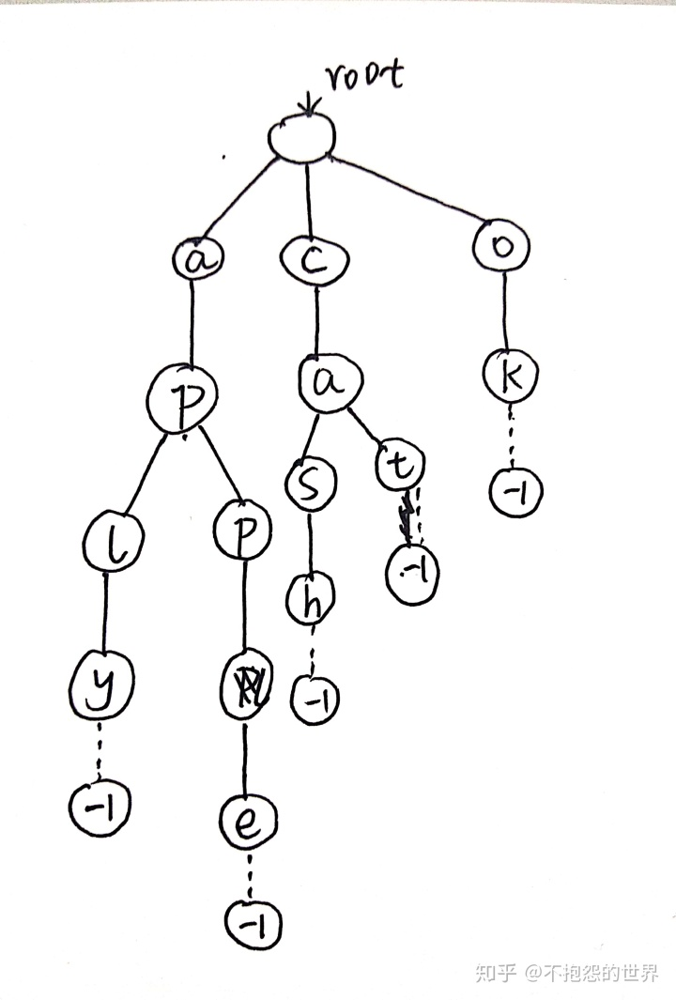

# 字典树\(Trie\)

查单词需要所以叫字典树

**问题场景：**

字典中有n个单词，存在STL的map里，现在有m个查询，每次查询一个单词，需要回答出这个单词是否在之前输入的n单词中出现过

* 暴力实现：
* STL中map/set实现：红黑树
* STL中unordered\_map/unordered\_set实现：hash\_table
* 针对于字符：更高效的数据结构解决这个问题：Trie树

对cat、cash、apple、aply、ok建立一颗字典树



* 在这篇文章中，我们主要讨论小写的英文字母查询，因此每个节点最多有26个子节点
* 整棵树的根节点是空的（这里我们设置根节点为root=0），这便于查找和插入
* 每个节点结束的时候用一个特殊的标记来表示，这里我们用-1来表示结束

**插入**

申请数组：root\[NUM\_NODE\]\[26\] \(26表示只考虑小写字母）

cnt初始为0，表示节点ID，root是0

```cpp
void Insert(char s[])
{
    int root=0;
    for(int i=0;s[i];i++) //s[i] = '\0'结束
    {
        int id=s[i]-'a';
        if(tree[root][id]==-1) tree[root][id]=++cnt; //新建节点
        sum[tree[root][id]];//用于统计前缀出现次数
        root=tree[root][id];
    }
}

```

**查找**

* 可以查找一个前缀
* 可以查找整个单词
* 可以统计一个前缀在单词表中出现的次数。

**从左往右扫描前缀单词中的每一个字母，然后从字典树的第一层开始找，能找到第一个字母就顺着字典树往下走，否则结束查找，即没有此前缀；若前缀单词扫完了到-1了，表示有这个前缀。**

```cpp
int Search(char s[])
{
    int root=0;
    for(int i=0;s[i];i++)
    {
        int id=s[i]-'a';
        if(tree[root][id]==-1) return -1;
        root=tree[root][id];
    }
}
```

**删除**

```cpp
void Delete(char s[]) //假定必然存在+删除成功
{
    int root=0;
    for(int i=0;s[i];i++) //s[i] = '\0'结束
    {
        int id=s[i]-'a';
        sum[tree[root][id]]--;
        root=tree[root][id];
        if(sum[tree[root][id]]==0)tree[root][id]=-1;//这种实现会造成节点空洞
    }
}
```

