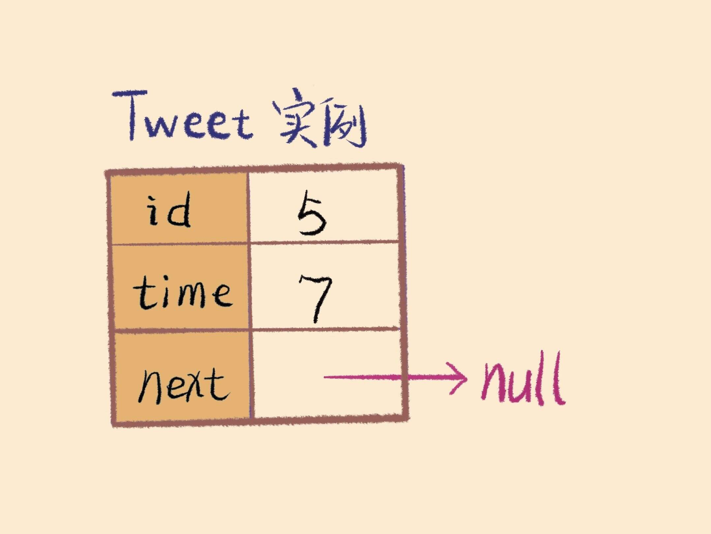
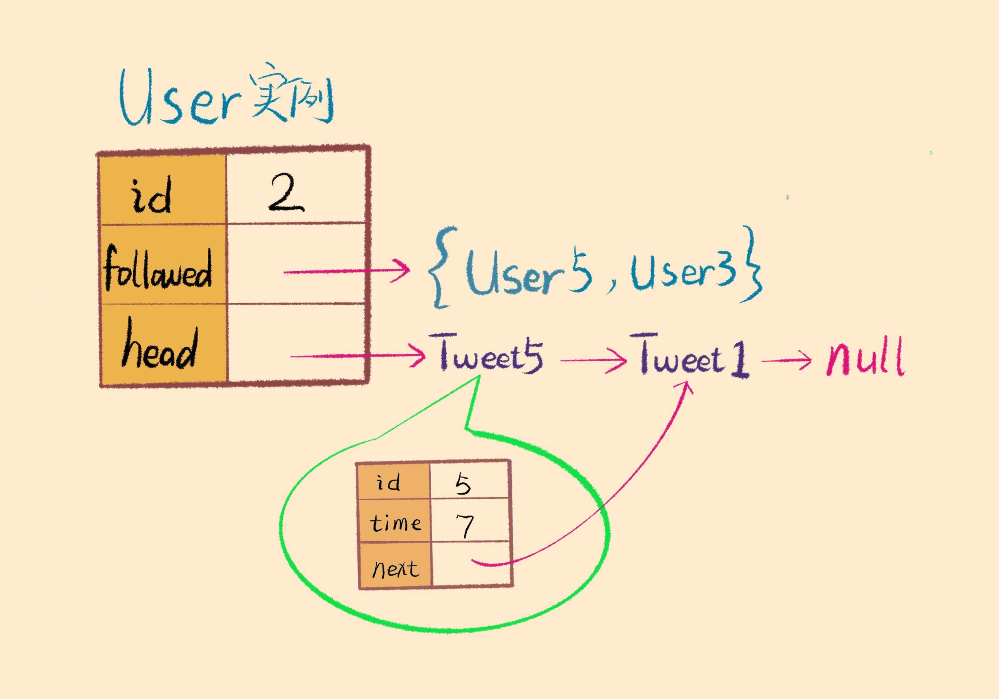
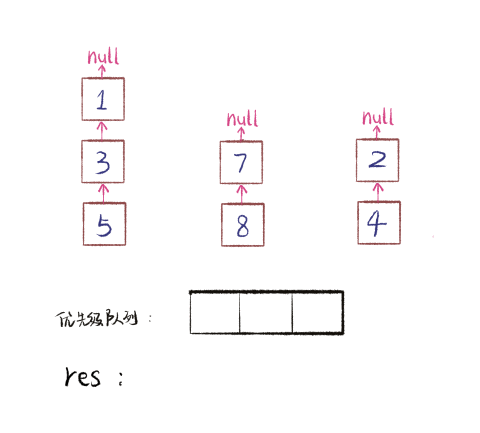

# Leetcode355 设计推特

### 场景（经典多路归并问题）

推特，以及中国的「微博」、「朋友圈」都是类似的场景，每个人都有自己的Tweet，每个人都有自己的Followee与Follower

当然真正的是实际应用都是在数据库中或者缓存中存储的，主要体现一个算法思想

题目是一个简化版的twitter：

* 用户实现发送推文
* 关注/取消关注其他用户
* 能够看见关注人（包括自己）的最近十条推文

### 数据结构（哈希集合 + 哈希表 + 链表 + 优先队列）

**一些考虑：**

1. 这里考虑到**读的业务**其实只有读最近的10条，完全可以用一个链表结构来存Tweet，时间靠前的在链表的head，不需要考虑搜索的业务

   **全局timestamp外部是一个static常量，每个tweet也有一个它的timestamp,每次post新推文的时候都timestamp++**

```cpp
class Tweet {
private:
    int id;
    int time;
    Tweet* next;
public:
    Tweet(int id, int time) {
        this.id = id;
        this.time = time;
        this->next = NULL;
    }
}
```



2. 因为followee的人相当于是有**写+读的业务，**这种关注取关可以用一个**hashSet**来存储，复杂度O\(logN\)，每个用户都有id，followed的hash set以及Tweet指针的head



3. 使用**哈希表**把user\_id与User类对象联系起来，因为调用函数的参数都是user\_id

4. **优先队列解决多路归并问题**

需要返回每个关注的人对应的链表中这些**所有多路的前十个，用优先队列实现，本质上是一种堆**

1）刚开始，先把每个followed set中的用户的Tweet Head加入到优先队列中

2）定义优先队列的比较是在timestamp上

3）然后优先队列的front就是最近的，取出这个最近Tweet，将这个最近Tweet的用户的next Tweet插入优先队列中，然后再同样类似的方式进行10次就可以得到结果



### 复杂度分析

* postTweet\(userId, tweetId\) O\(1\) //插入链表
* getNewsFeed\(userId\) O\(M\*logN\) //返回M个最近元素，优先队列返回和插入
* follow\(followerId, followeeId\) O\(logN\) //插入哈希集合
* unfollow\(followerId, followeeId\) O\(logN\) //从哈希表中移除

### 实现

```cpp
class Tweet{
private:
    int id;
    int time;
    Tweet* next;
public:
    Tweet(int id, int time){
        this->id = id;
        this->time = time;
        this->next = NULL;
    }
    void setNext(Tweet* next){
        this->next = next;
    }
    Tweet* getNext(){
        return next;
    }
    int getTime(){
        return time;
    }
    int getId(){
        return id;
    }
};

class User{
private:
    int id;
    unordered_set<int> followed;
    Tweet* head;
public:
    User(int id){
        this->id = id;
        this->followed.clear();
        this->head = NULL;
    }
    Tweet* getHead(){
        return head;
    }
    unordered_set<int> getFollowed(){
        return followed;
    }
    void setHead(Tweet* head){
        this->head = head;
    }
    void follow(int id){
        if(!followed.count(id)){
            followed.insert(id);
        }
    }
    void unfollow(int id){
        if(followed.count(id)){
            followed.erase(id);
        }
    }
};

struct cmp{
    bool operator()(Tweet* a, Tweet* b){
        return a->getTime() < b->getTime();
    };
};

class Twitter {
private:
    unordered_map<int, User*> users;
    int timestamp = 0;
public:
    /** Initialize your data structure here. */
    Twitter(){
        users.clear();
        timestamp = 0;
    }
    void createUser(int userId){
        users[userId] = new User(userId);
    }
    /** Compose a new tweet. */
    void postTweet(int userId, int tweetId) {
        if(!users.count(userId))createUser(userId); //不存在就创建！
        Tweet* newtweet = new Tweet(tweetId, timestamp++);
        newtweet->setNext(users[userId]->getHead());
        users[userId]->setHead(newtweet);
    }
    
    /** Retrieve the 10 most recent tweet ids in the user's news feed. Each item in the news feed must be posted by users who the user followed or by the user herself. Tweets must be ordered from most recent to least recent. */
    vector<int> getNewsFeed(int userId) {
        vector<int> res;
        if(users.count(userId)){
            priority_queue<Tweet*, vector<Tweet*>, cmp> recent_tweets;
            unordered_set<int> followed = users[userId]->getFollowed();
            followed.insert(userId); //注意还要包括自己！
            for(auto it=followed.begin(); it!=followed.end(); it++){
                if(users.count(*it) && users[*it]->getHead()){//一定不要在优先队列插入NULL
                    recent_tweets.push(users[*it]->getHead());
                }
            }
            int count = 10;
            while(count--){
                if(!recent_tweets.empty()){
                    res.push_back(recent_tweets.top()->getId());
                    if(recent_tweets.top()->getNext())recent_tweets.push(nxt);//一定不要在优先队列插入NULL
                    recent_tweets.pop();
                }else break;
            }
        }
        return res;
    }
    
    /** Follower follows a followee. If the operation is invalid, it should be a no-op. */
    void follow(int followerId, int followeeId) {
        if(!users.count(followerId))createUser(followerId); //不存在就创建！
        if(!users.count(followeeId))createUser(followeeId); //不存在就创建！
        User* follower = users[followerId];
        follower->follow(followeeId);
    }
    
    /** Follower unfollows a followee. If the operation is invalid, it should be a no-op. */
    void unfollow(int followerId, int followeeId) {
        if(users.count(followerId)){
            User* follower = users[followerId];
            follower->unfollow(followeeId);
        }
    }
};
```

测试样例：

```cpp
// Your Twitter object will be instantiated and called as such:
 Twitter* obj = new Twitter();
 obj->postTweet(userId,tweetId);
 vector<int> param_2 = obj->getNewsFeed(userId);
 obj->follow(followerId,followeeId);
 obj->unfollow(followerId,followeeId);
```


